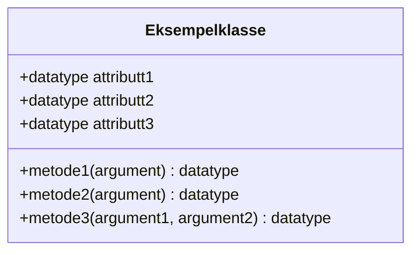
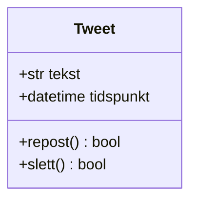
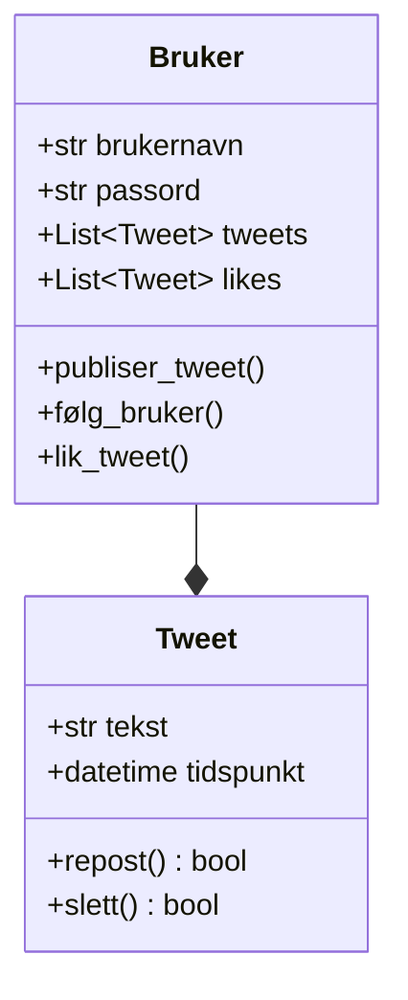
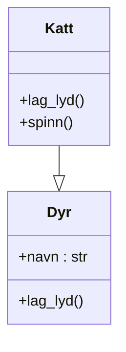
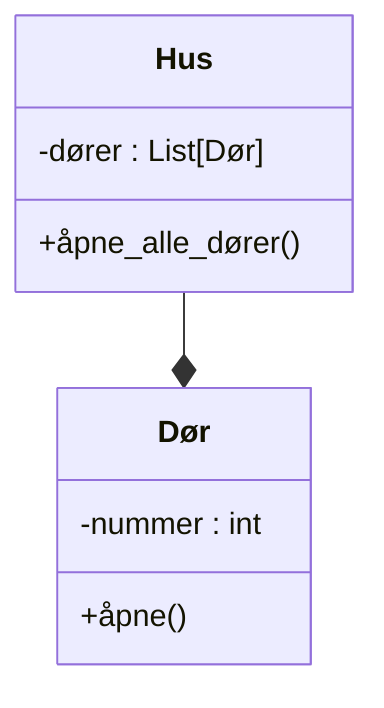
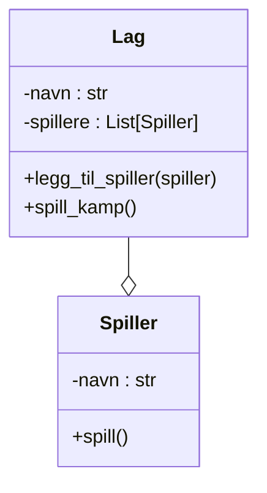
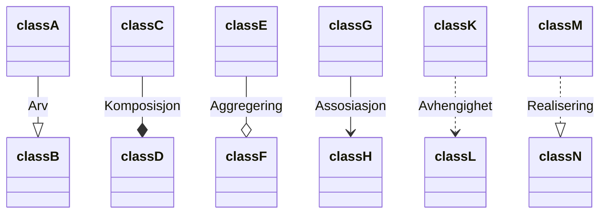
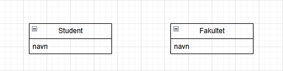
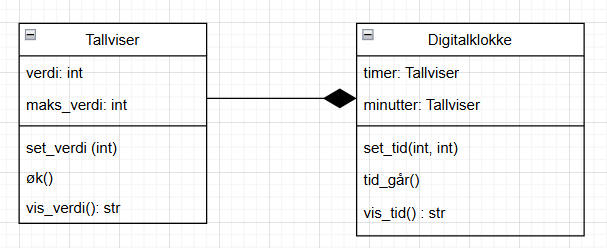

Objektorientert modellering (OOM) er verktøy som brukes for å modellere objektorienterte programmer.
Som oftest dreier det seg om å lage diagrammer som beskriver strukturen i et program.

I IT2 skal vi bruke klassediagrammer som følger [UML-standaren](https://en.wikipedia.org/wiki/Unified_Modeling_Language) for å modellere programmene våre.


<details>
<summary>Forskjellen på objektorientert modellering og objektorientert programmering</summary>

Objektorientert modellering og objektorientert programmering henger tett sammen, men er ikke det samme.

**Objektorientert modellering** brukes som regel i planleggingsfasen.
Her beskriver man hvilke klasser systemet skal bestå av, hvilke attributter og metoder de har, og hvordan klassene henger sammen.

**Objektorientert programmering** handler om å skrive kode som følger modellen som er laget i planleggingsfasen.
Da skriver man faktisk kode som følger strukturen som er planlagt i UML.

Kort sagt kan man si at objektorientert modellering svarer på *hva systemet skal bestå av*, mens objektorientert programmering svarer på *hvordan systemet fungerer i praksis*.

</details>

## UML-diagrammer i VS Code

1. Last ned utvidelsen [Mermaid Editor](https://marketplace.visualstudio.com/items?itemName=tomoyukim.vscode-mermaid-editor)
2. Lag en ny fil med filendelsen `.mmd` eller `.mermaid`
3. Skriv kode for et diagram
4. Høyreklikk i fila og velg `Mermaid:Generate image`
5. Et bilde med filendelsen `.svg` vil dukke opp i samme mappe som `.mmd`/`.mermaid`-fila.

> [Her er eksempler på mermaid-kode for klassediagrammer.](https://mermaid.ai/open-source/syntax/classDiagram.html)

## Klassediagram

<details>
<summary>Nyttige begreper i objektorientert programmering/modellering</summary>

* **Klasse**: En mal for objekter, for eksempel `Elev`.
* **Objekt**: Et konkret eksemplar av en klasse, for eksempel én bestemt elev.
* **Attributter**: Egenskaper ved en klasse, for eksempel navn og alder.
* **Metoder**: Funksjoner som beskriver hva et objekt kan gjøre.
* **Konstruktør**: En metode som brukes til å opprette nye objekter.

</details>

Klassediagrammer er UML-diagrammer som viser en oversikt over klasser og relasjoner mellom klasser.

### Klasser

I klassediagrammer vises klasser som en boks som inneholder en oversikt over klassenes attributter og metoder.

> `+` betyr *public* og `-` betyr *private*.



<details>
<summary>Mermaid-kode</summary>

```
classDiagram
    class Eksempelklasse{
        +datatype attributt1
        +datatype attributt2
        +datatype attributt3
        ...

        +metode1(argument) datatype
        +metode2(argument) datatype
        +metode3(argument1, argument2) datatype
    }
```

</details>

Diagrammet under viser et eksempel på en klasse for Tweets (poster) på Twitter:



<details>
<summary>Mermaid-kode</summary>

```
classDiagram
    class Tweet{
        +str tekst
        +datetime tidspunkt
        +repost() bool
        +slett() bool
    }
```

</details>

### Relasjoner

Relasjoner mellom klasser vises i klassediagrammer som streker, med et lite symbol i den ene enden som viser hvilken type relasjonen er.

I eksempelet under har klassen `Bruker` en relasjon til klassen `Tweet` gjennom listene `tweets` og `likes`.
Diamanten i enden av streken viser at relasjonen er en [*komposisjon*](#komposisjon-composition).



<details>
<summary>Mermaid-kode</summary>

```text {2}
classDiagram
    Bruker --* Tweet
    class Bruker{
        +str brukernavn
        +str passord
        +publiser_tweet()
        +følg_bruker()
        +lik_tweet()
    }
    class Tweet{
        +str tekst
        +Bruker bruker
        +int likes
        +datetime tidspunkt
    }
```

</details>

#### Relasjonstyper

| Relasjon    | Typisk betydning | Eksempel                   | Forklaring                                                                              |
| ----------- | ---------------- | -------------------------- | --------------------------------------------------------------------------------------- |
| Arv         | er-en/er-et      | `Katt` er et `Dyr`         | `Katt` er en *spesialisering* av `Dyr`, mens `Dyr` er en *generalisering* av `Katt`.    |
| Komposisjon | Eier             | `Hus` eier en `Dør`        | `Dør` kan ikke eksistere uten `Hus`. Når `Hus` slettes, slettes også `Dør`.             |
| Aggregering | Har              | `Spiller` har et `Lag`     | `Spiller` kan eksitere uten å ha et `Lag`. Når `Lag` slettes, slettes *ikke* `Spiller`. |

#### Arv (Inheritance / Generalization)

```
Katt --|> Dyr
```

**Betydning:**
`Katt` arver fra `Dyr`.

* `Katt` er en *spesialisering* av `Dyr`
* `Dyr` er en *generalisering* av `Dyr`
* `Katt` *arver* attributter og metoder fra `Dyr`
* Representerer et **er-et-**/**er-en-** relasjon, vi kan si at `Katt` *er et* `Dyr`.

> Pilen skal peke mot klassen det arves fra.



<details>
<summary>Mermaid-kode</summary>

```text
classDiagram
Katt --|> Dyr

class Dyr {
    +navn : str
    +lag_lyd()
}

class Katt {
    +lag_lyd()
    +spinn()
}

```
</details>

<details>
<summary>Python-kode</summary>

```python
class Dyr:
    def __init__(self, navn: str):
        self.navn = navn

    def lag_lyd(self):
        print("Dyret lager en lyd")


class Katt(Dyr):
    def __init__(self, navn: str):
        # Kjører init-metoden til Dyr
        super().__init__(navn)

    def lag_lyd(self):
        # Overstyrer metode fra Dyr
        print(f"{self.navn} sier mjau")

    def spinn(self):
        print(f"{self.navn} spinner")


# Bruk
dyr = Dyr("Ukjent dyr")
dyr.lag_lyd()

katt = Katt("Pus")
katt.lag_lyd()   # arvet + overstyrt
katt.spinn()     # kun i Katt

```

</details>

#### Komposisjon (Composition)

```
Hus --* Dør
```

* `Hus` eier `Dør`
* `Dør` kan **ikke eksistere uten** `Hus`
* Når `Hus` slettes, slettes også `Dør`

> Diamanten skal være på den siden som *eies*.



<details>
<summary>Mermaid-kode</summary>

```text
classDiagram
Hus --* Dør

class Hus {
    -dører : List[Dør]
    +åpne_alle_dører()
}

class Dør {
    -nummer : int
    +åpne()
}

```

</details>


<details>
<summary>Python-kode</summary>

```python
class Dør:
    def __init__(self, nummer: int):
        self.nummer = nummer

    def åpne(self):
        print(f"Dør {self.nummer} åpnes")


class Hus:
    def __init__(self, antall_dører: int):
        self.dører: list[Dør] = []
        for i in range(antall_dører):
            self.dører.append(Dør(i))

    def åpne_alle_dører(self):
        for dør in self.dører:
            dør.åpne()


# Bruk
hus = Hus(2)
hus.åpne_alle_dører()

hus = None # Alle dørene forsvinner når hus slettes
```

</details>


#### Aggregering (Aggregation)

```
Lag --o Spiller
```

* `Lag` har `Spiller`
* `Spiller` kan eksistere uavhengig av `Lag`
* Hvis `Lag` slettes, slettes *ikke* `Spiller`

> Diamanten skal være på den siden som *has*.



<details>
<summary>Mermaid-kode</summary>

```text
classDiagram
Lag --o Spiller

class Lag {
    -navn : str
    -spillere : List[Spiller]
    +legg_til_spiller(spiller)
    +spill_kamp()
}

class Spiller {
    -navn : str
    +spill()
}

```

</details>

<details>
<summary>Python-kode</summary>

```python
class Spiller:
    def __init__(self, navn: str):
        self.navn = navn

    def spill(self):
        print(f"{self.navn} spiller")


class Lag:
    def __init__(self, navn: str):
        self.navn = navn
        self.spillere: list[Spiller] = []

    def legg_til_spiller(self, spiller: Spiller):
        self.spillere.append(spiller)

    def spill_kamp(self):
        print(f"Lag {self.navn} spiller kamp")
        for spiller in self.spillere:
            spiller.spill()


# Spiller eksisterer uavhengig av lag
spiller1 = Spiller("Erling Braut Haaland")
spiller2 = Spiller("Phil Foden")

# Oppretter et lag
lag = Lag("Manchester City")
# Legger til spillere i laget
lag.legg_til_spiller(spiller1)
lag.legg_til_spiller(spiller2)

lag.spill_kamp()

# Laget slettes ...
lag = None

# ... men en spillerne finnes fortsatt
spiller1.spill()
spiller2.spill()
```

</details>

#### Flere relasjonstype

<details>
<summary>Les om flere relasjonstyper her.</summary>

I UML-klassediagrammer finnes det flere relasjonstyper.
Diagrammet under viser alle de forskjellige typene.



```text
classDiagram
classA --|> classB : Arv
classC --* classD : Komposisjon
classE --o classF : Aggregering
classG --> classH : Assosiasjon
classK ..> classL : Avhengighet
classM ..|> classN : Realisering
```


#### Association (Assosiasjon)

```
classG --> classH
```

**Generell relasjon mellom to klasser**

* `classG` kjenner til eller bruker `classH`
* Pilen viser navigerbarhet
* Ingen eierskap eller livssyklus implisert

**Eksempel:**
`Order --> Customer`

---

#### Link (Solid linje)

```
classI -- classJ
```

**Uspesifisert assosiasjon**

* Klassene er relatert
* Ingen retning eller semantikk angitt
* Brukes ofte i forenklede diagrammer

---

#### Dependency (Avhengighet)

```
classK ..> classL
```

**Svak og midlertidig relasjon**

* `classK` bruker `classL`
* Ofte via:

  * metodeparametere
  * lokale variabler
  * statiske metodekall
* Endringer i `classL` kan påvirke `classK`

**Eksempel:**
`ReportService ..> PDFGenerator`

---

#### Realization (Realisering)

```
classM ..|> classN
```

**Implementasjon av interface**

* `classN` er et interface
* `classM` implementerer kontrakten
* Brukes i objektorientert design

**Eksempel:**
`MySqlRepository ..|> Repository`

---

#### Link (Dashed / stiplet linje)

```
classO .. classP
```

**Uformell eller konseptuell relasjon**

* Ikke like strengt definert i UML
* Brukes ofte for:

  * konseptuelle koblinger
  * annotasjoner
  * høy-nivå-relasjoner

I strenge UML-diagrammer erstattes denne ofte av **Dependency**.


</details>

## Eksamensoppgaver

#### Oppgave 1


Hva er hovedprinsippet bak objektorientert programmering (OOP)? Velg riktig alternativ.

- å lage lineære og sekvensielle programkoder
- å bryte ned et problem i et sett med funksjoner
- å representere data og funksjoner som objekter
- å minimere bruken av variabler

#### Oppgave 2

Hvilket av følgende alternativer beskriver best en klasse i objektorientert programmering (OOP)?

- En klasse er en instans av et objekt.
- En klasse er en funksjon som utfører en spesifikk oppgave.
- En klasse er en mal eller en prototype for objekter.
- En klasse er en metode for å lagre data.

#### Oppgave 3

Hvis en klasse B arver fra klasse A, hvilken betegnelse er mest korrekt for klasse B i forhold til klasse A i objektorientert modellering?

- B er en spesialisering av A.
- B er en assosiert klasse til A.
- B er en generalisering av A.
- B er en avhengig klasse av A.

#### Oppgave 4

En utvikler som modellerer et objektorientert program, oppdager at flere av klassene har like eller lignende metoder og egenskaper. Utvikleren velger å generalisere de felles metodene og egenskapene til en superklasse.
Hvilket prinsipp eller hvilken mekanisme må implementeres for å realisere denne modellen med objektorientert programmering?

- abstraksjon
- polymorfisme
- innkapsling
- arv

#### Oppgave 5

Hvilket av de følgende prinsippene innen objektorientert programmering handler om gjenbruk av kode?
Velg riktig svar:

- abstraksjon
- polymorfisme
- innkapsling
- arv

#### Oppgave 6

En egenskap (et felt) i objekter av en klasse inneholder objekter av en annen klasse.
Hva er riktig type relasjon mellom de to klassene i objektorientert modellering (OOM)?

- assosiasjon
- generalisering
- komposisjon
- aggregering

#### Oppgave 7

Vi ønsker å lage en liten kalkulator for de fire regneoperasjonene: minus, pluss, gange og dele.
Nedenfor finner du pseudokode som beskriver en del av en løsning ved hjelp av fire funksjoner:

```text
FUNCTION pluss(a, b)
    RETURN a + b
ENDFUNCTION

FUNCTION minus(a, b)
    RETURN a - b
ENDFUNCTION

FUNCTION gange(a, b)
    RETURN a * b
ENDFUNCTION

FUNCTION dele(a, b)
    RETURN a / b
ENDFUNCTION
```

1. Lag et klassediagram for en tilsvarende klasse kalt Kalkulator til bruk i en objektorientert løsning.
2. Implementer klassen i ditt programmeringsspråk.
3. Implementer et egnet testprogram for å teste løsningen, og identifiser mulige feil og unntak.
4. Implementer nødvendig håndtering av mulige feil og unntak.


#### Oppgave 8

På et universitet kan studentene velge å knytte seg til et valgfritt fakultet og da bli en del av fakultetet.
Dette er modellert med de to klassene Student og Fakultet i klassediagrammet nedenfor.



**a)**

Se på klassediagrammet ovenfor.
Hva er riktig type relasjon mellom de to klassene i objektorientert modellering (OOM)?

- aggregering
- generalisering
- komposisjon
- avhengighet

**b)**

Begrunn svaret ditt på oppgave 2a i tekstboksen nedenfor.

#### Oppgave 9


I denne oppgaven får du utdelt et klassediagram som viser strukturen til en digital klokke.
Diagrammet består av to klasser: Tallviser og Digitalklokke.

Tallviser representerer en enkel teller med en verdi og en maksimal verdi.
Den kan brukes for timer og minutter.

Digitalklokke består av to tallvisere, en for timer og en for minutter, og har metoder for å stille inn tiden, la tiden gå og vise tiden som tekst.



**a)**

Forklar diagrammet ved å beskrive relasjonen mellom klassene og hva klassene representerer.

Du skal også identifisere og forklare attributtene og metodene i klassene.

**b)**

Implementer klassene i ditt programmeringsspråk ved å lage klassen Tallviser med alle nødvendige attributter og metoder, og ved å lage klassen Digitalklokke, som bruker to instanser av klassen Tallviser.


**c)**

Implementer et testprogram som oppretter en instans av klassen Digitalklokke, og som tester metodene for å stille inn tid, la tiden gå og vise tiden. Test også at 60 minutter blir til en time når klokken går.

**d)**

Implementer nødvendig håndtering av feil og unntak i programmet.

Hvis du allerede har skrevet programmet slik at dette er håndtert, trenger du bare å påpeke dette med kommentarer i koden.
