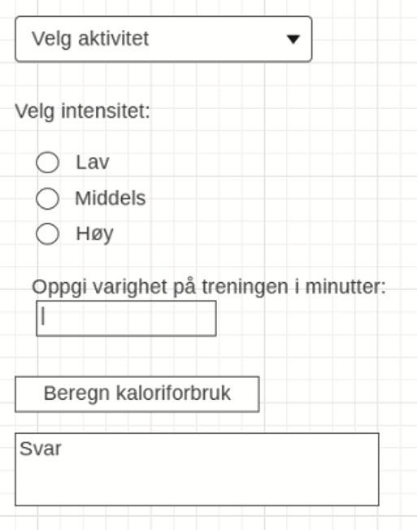

Flask er et _rammeverk_ for å lage nettsider med Python.

> Et _rammeverk_ i programmering er et ferdig oppsett med verktøy og regler som hjelper deg å lage programmer/apper/nettsider/spill raskere og mer strukturert.

Det kan installeres med `pip install flask`/`pip3 install flask` og importeres som en modul i Python.

## 1.1 Hallo, verden!

```python
# importerer Flask fra flask-modulen
from flask import Flask

# oppretter en app som har samme navn som filnavnet
app = Flask(__name__)

# en rute for /
@app.get("/")
def hello_world():
    return "<h1>Hallo, verden!</h1>"

# kjører appen og debug-modus
app.run(debug=True)

```

## 1.2 Forms

Med *Forms* og Flask kan vi sende data fra html til Python.

### Hallo, navn!

app.py
```python
from flask import Flask, render_template, request

app = Flask(__name__)

@app.get("/")
def rute_index():
    return render_template("index.html")

@app.get("/hallo")
def rute_hallo():
    navn = request.values.get("navn") # henter navn som ble sendt fra html
    return render_template("hallo.html", navn=navn)

app.run(debug=True)
```

templates/index.html

```html
<form action="/hallo" method="get">
    <label>Navn:</label>
    <input type="text" name="navn">
    <button type="submit">Send inn</button>
</form>
```

templates/hallo.html

```html
<h1>Hallo, {{navn}}!</h1>
```

### Input-elementer

Alle input-elementer må ha attributten `name`, det er en som angir navnet input-verdien får i app.py.

For eksempel kan verdien til dette input-elementet:

```html
<input type="number" name="alder">
```

hentes ut i app.py med
```python
request.values.get("alder")
```

#### Liste over input-elementer

Her er noen vanlige input-elementer.

| Element                               | På nettsiden                        |
| ------------------------------------- | ----------------------------------- |
| `<input type="text" name="NAVN">`     | <input type="text" name="NAVN">     |
| `<input type="number" name="NAVN">`   | <input type="number" name="NAVN">   |
| `<input type="checkbox" name="NAVN">` | <input type="checkbox" name="NAVN"> |
| `<input type="color" name="NAVN">`    | <input type="color" name="NAVN">    |
| `<input type="date" name="NAVN">`     | <input type="date" name="NAVN">     |
| `<input type="file" name="NAVN">`     | <input type="file" name="NAVN">     |
| `<input type="hidden" name="NAVN">`   | <input type="hidden" name="NAVN">   |
| `<input type="password" name="NAVN">` | <input type="password" name="NAVN"> |

#### Eksempel: brukernavn og passord

```html
 <form action="/logg-inn" method="post">
  <label for="brukernavn">Brukernavn:</label><br>
  <input type="text" id="brukernavn" name="brukernavn"><br>
  <label for="passord">Passord:</label><br>
  <input type="password" id="passord" name="passord">
  <button type="submit">Logg inn</button>
</form>
```
<div style="border: solid 1px black; padding: 5px;">
 <form>
  <label for="brukernavn">Brukernavn:</label><br>
  <input type="text" id="brukernavn" name="brukernavn"><br>
  <label for="passord">Passord:</label><br>
  <input type="password" id="passord" name="passord">
  <button style="background-color: lightgrey; border-radius:2px; margin-top: 4px;">Logg inn</button>
 </form>
</div>

app.py

```python
...

@app.post("/logg-inn")
def rute_hallo():
    brukernavn = request.values.get("brukernavn")
    passord = request.values.get("passord")
    # gjør noe med brukernavn og passord..
    return render_template("index.html")

...
```

> post-metoden viser ikke det som sendes i url-en.

### Radioknapper

Radioknapper lar brukeren velge mellom flere valg, der bare ett valg kan velges om gangen.
For at det skal fungere må alle radio-knappene ha samme `name`.

<form>
<fieldset>
    <legend>Velg din favoritt:</legend>
    <div>
        <input type="radio" id="ronny" name="favoritt" value="ronny" checked>
        <label for="ronny">Ronny</label>
    </div>
    <div>
        <input type="radio" id="hermine" name="favoritt" value="hermine">
        <label for="hermine">Hermine</label>
    </div>
    <div>
        <input type="radio" id="harry" name="favoritt" value="harry">
        <label for="harry">Harry</label>
    </div>
</fieldset>
  <button style="background-color: lightgrey; border-radius:2px; margin-top: 4px;">Velg</button>
</form>

```html
<form action="/valg">
    <fieldset>
      <legend>Velg din favoritt:</legend>

      <div>
        <input type="radio" id="ronny" name="favoritt" value="ronny" checked>
        <label for="ronny">Ronny</label>
      </div>

      <div>
        <input type="radio" id="hermine" name="favoritt" value="hermine">
        <label for="hermine">Hermine</label>
      </div>

      <div>
        <input type="radio" id="harry" name="favoritt" value="harry">
        <label for="harry">Harry</label>
      </div>
    </fieldset>
    <button type="submit">Velg</button>
</form>
```


```python
...

@app.post("/valg")
def rute_hallo():
    favoritt = request.values.get("favoritt") # favoritt er enten ronny, hermine eller harry
    # gjør noe med favoritt..
    return render_template("index.html")

...
```

> `<fieldset>` og `<legend>` lager en ramme rundt radio-knappene.

### Avkrysningsbokser

Avkrysningsbokser lar brukeren krysse av flere bokser, i Python blir verdiene til `True` eller `False`.

<form action="">
    <fieldset>
        <legend>Choose your monster's features:</legend>
        <div>
            <input type="checkbox" id="scales" name="scales" checked>
            <label for="scales">Scales</label>
        </div>
        <div>
            <input type="checkbox" id="horns" name="horns">
            <label for="horns">Horns</label>
        </div>
    </fieldset>
  <button style="background-color: lightgrey; border-radius:2px; margin-top: 4px;">Velg</button>
</form>


```html
<form action="/valg">
    <fieldset>
        <legend>Choose your monster's features:</legend>

        <div>
            <input type="checkbox" id="scales" name="scales" checked>
            <label for="scales">Scales</label>
        </div>

        <div>
            <input type="checkbox" id="horns" name="horns">
            <label for="horns">Horns</label>
        </div>
    </fieldset>
    <button type="submit">Velg</button>
</form>
```

```python
...

@app.post("/valg")
def rute_hallo():
    scales = request.values.get("scales") # True/False
    horns = request.values.get("horns") # True/False
    # gjør noe med scales og horns..
    return render_template("index.html")

...
```

### Nedtrekksboks

<fieldset>
<label for="pet-select">Choose a pet:</label>
<select name="pets" id="pet-select">
  <option value="" selected>--Please choose an option--</option>
  <option value="dog">Dog</option>
  <option value="cat">Cat</option>
  <option value="hamster">Hamster</option>
  <option value="parrot">Parrot</option>
  <option value="spider">Spider</option>
  <option value="goldfish">Goldfish</option>
</select>
</fieldset>

```html
<label for="pet-select">Choose a pet:</label>

<select name="pets" id="pet-select">
  <option value="" selected>--Please choose an option--</option>
  <option value="dog">Dog</option>
  <option value="cat">Cat</option>
  <option value="hamster">Hamster</option>
  <option value="parrot">Parrot</option>
  <option value="spider">Spider</option>
  <option value="goldfish">Goldfish</option>
</select>
```

```python
...

@app.post("/valg")
def rute_hallo():
    pets = request.values.get("pets") # verdien til det som er valgt
    # gjør noe med pets..
    return render_template("index.html")

...
```

#### Nedtrekksboks med valg fra Python-liste

<fieldset>
<select name="favorittdyr">
    <option value="" selected="">--Trykk her for å velge--</option>
    <option value="dyr">Hund</option>
    <option value="dyr">Katt</option>
    <option value="dyr">Hamster</option>
    <option value="dyr">Edderkopp</option>
    <option value="dyr">Papegøye</option>
</select>
</fieldset>

```python
from flask import Flask, render_template, request

app = Flask(__name__)

dyreliste = ["Hund", "Katt", "Hamster", "Edderkopp", "Papegøye"]

@app.get("/")
def rute_index():
    return render_template("index.html", dyreliste=dyreliste)

app.run(debug=True)
```

```html
<select name="favorittdyr">
    <option value="" selected>--Trykk her for å velge--</option>
    
        <option value="dyr">{{dyr}}</option>
    
</select>
```

## 1.3 Tabeller

HTML-tabeller er nyttige for å vise lister og ordbøker fra Python på en enkel og fin måte.

I app.py sendes en liste med personer til html-fila index.html.

```python {5-9, 13}
from flask import Flask, render_template, request

app = Flask(__name__)

personer = [
    {"Navn": "Thor", "Alder": 35, "By": "Kristiansand"},
    {"Navn": "Martin", "Alder": 37, "By": "Bergen"},
    {"Navn": "Ravi", "Alder": 45, "By": "Tønsberg"}
]

@app.get("/")
def rute_index():
    return render_template("index.html", personer=personer)

app.run(debug=True)
```

#### HTML

I HTML lages tabeller med `<table>`-taggen, som deles inn i `<thead>` for overskrifter og `<tbody>` for innhold.
Linjer i tabellen defineres i `<tr>` og datapunkter med `<td>`.

I IT2 gidder vi ikke style tabellene våre, så vi bruker et CSS-rammeverk - se linje 7.

For-løkken på linjene 19 til 25 går lager en rad for hver person i listen personer.

```html {7,19-25}
<!DOCTYPE html>
<html lang="no">
<head>
    <meta charset="UTF-8">
    <meta name="viewport" content="width=device-width, initial-scale=1.0">
    <title>Tabeller i Flask</title>
    <link rel="stylesheet" href="https://cdn.jsdelivr.net/npm/@picocss/pico@2/css/pico.min.css">
</head>
<body>
    <table>
        <thead>
            <tr>
                <th>Navn</th>
                <th>Alder</th>
                <th>By</th>
            </tr>
        </thead>
        <tbody>
            
            <tr>
                <td>{{person["Navn"]}}</td>
                <td>{{person["Alder"]}}</td>
                <td>{{person["By"]}}</td>
            </tr>
            
        </tbody>
    </table>
</body>
</body>
</html>
```

## 1.4 Plotting

For å plotte i Flask kan vi bruke javascript-biblioteket [Chart.js](https://www.chartjs.org/).
Det importeres ved å lime inn `<script src="https://cdn.jsdelivr.net/npm/chart.js"></script>` i head-taggen.

Chart.js bruker lister for å plotte.
I app.py må vi konvertere data-en vi vil plotte til lister:

```python {13-14}
from flask import Flask, render_template, request

app = Flask(__name__)

personer = [
    {"Navn": "Thor", "Alder": 35, "By": "Kristiansand"},
    {"Navn": "Martin", "Alder": 37, "By": "Bergen"},
    {"Navn": "Ravi", "Alder": 45, "By": "Tønsberg"}
]

@app.get("/")
def rute_index():
    navn = [person["Navn"] for person in personer]
    alder = [person["Alder"] for person in personer]
    return render_template("plott.html", navn=navn, alder=alder)

app.run(debug=True)

```

I HTML-koden må listene konverteres til Javascript-lister, ved å bruke `| tojson`:

```js
const navn = {{ navn | tojson }};
const alder = {{ alder | tojson }};
```

Hele HTML-koden blir da:

```html {7, 13, 15-30}
<!DOCTYPE html>
<html lang="no">
<head>
    <meta charset="UTF-8">
    <title>Plotting i Flask</title>
    <link rel="stylesheet" href="https://cdn.jsdelivr.net/npm/@picocss/pico@2/css/pico.min.css">
    <script src="https://cdn.jsdelivr.net/npm/chart.js"></script>
</head>
<body>

<h2>Alder per person</h2>

<canvas id="plott"></canvas>

<script>
    const navn = {{ navn | tojson }};
    const alder = {{ alder | tojson }};
    const plott = document.querySelector("#plott")

    new Chart(plott, {
        type: "bar",
        data: {
            labels: navn,
            datasets: [{
                label: "Alder",
                data: alder
            }]
        }
    });
</script>

</body>
</html>
```

## 1.5 Oppgaver

### Aktivitetskalkulator

> Oppgave 2 fra eksamen høsten 2019

Lag en applikasjon som beregner kaloriforbruk for en gitt aktivitet - en slags treningskalkulator.
Beregningen skal basere seg på valgt **aktivitet** i kombinasjon med valgt **intensitet** og **varighet** på treningen.

#### Krav

- Brukeren skal kunne velge mellom disse fem aktivitetene:
  - Aerobics (841 kcal/time)
  - Bordtennis (236 kcal/time)
  - Fotball (510 kcal/time)
  - Golf (244 kcal/time)
  - Jogging (666 kcal/time)
- Brukeren skal kunne velge mellom disse intensitetsnivåene:
  - Lavt (Du kan gange kaloriforbruket med 0,8 for å trekke fra 20 %.)
  - Middels (Kaloriforbruket som er oppgitt.)
  - Høyt (Du kan gange kaloriforbruket med 1,2 for å kegge til 20 %.)
  - Brukeren skal kunne oppgi varighet i minutter.

- Løsningen skal implementeres etter denne grensesnittskissen (*wireframe*):
  - Brukeren skal velge aktivitet fra en nedtrekksliste.
  - Brukeren skal velge intensitet på treningen ved å velge én av tre radiobuttons.
  - Brukeren skal oppgi varighet på treningen i minutter i et tekstfelt.
  - Ved klikk på knappen skal kaloriforbruket for valgt aktivitet, intensitet og angitt varighet beregnes og vises.



### Energiinhold i frokost

> Oppgave 3 fra eksamen høsten 2013

Det er vanlig å bruke kilokalorier (kcal) som mål på hvor mye energi mat inneholder. Denne energien får vi i oss i form av proteiner, fett og karbohydrater. Alle matvarer har forskjellig andel av disse tre, og under ser du en tabell som viser hvor mye proteiner, fett og karbohydrater det er i «typiske» frokostenheter.

#### Tabell over frokostenheter:

| Matvare                   | Energi (kcal) | Protein (g) | Fett (g) | Karbohydrater (g) |
| ------------------------- | ------------- | ----------- | -------- | ----------------- |
| Lettmelk (1 glass à 2 dl) | 92            | 6.6         | 3        | 9.6               |
| 1 egg                     | 80            | 6.9         | 5.5      | 0.7               |
| Grovbrød (1 skive = 40 g) | 103           | 3.5         | 1        | 19.6              |
| Smør (til 1 brødskive)    | 36            | 0.025       | 4.1      | 0.025             |
| Gulost (1 skive)          | 53            | 4           | 4.2      | 0                 |


a) Lag en applikasjon der brukeren får se tabellen over.

<details><summary>Matvarer i JSON-format</summary>

```python
[
  {
    "matvare": "Lettmelk (1 glass à 2 dl)",
    "kcal": 92,
    "protein_gram": 6.6,
    "fett_gram": 3,
    "karbohydrater_gram": 9.6
  },
  {
    "matvare": "1 egg",
    "kcal": 80,
    "protein_gram": 6.9,
    "fett_gram": 5.5,
    "karbohydrater_gram": 0.7
  },
  {
    "matvare": "Grovbrød (1 skive = 40 g)",
    "kcal": 103,
    "protein_gram": 3.5,
    "fett_gram": 1,
    "karbohydrater_gram": 19.6
  },
  {
    "matvare": "Smør (til 1 brødskive)",
    "kcal": 36,
    "protein_gram": 0.025,
    "fett_gram": 4.1,
    "karbohydrater_gram": 0.025
  },
  {
    "matvare": "Gulost (1 skive)",
    "kcal": 53,
    "protein_gram": 4,
    "fett_gram": 4.2,
    "karbohydrater_gram": 0
  }
]
```

</details>

b) Brukeren skal kunne sette sammen sin egen frokost av disse matvarene og få informasjon om hvor mye energi (kcal) denne frokosten inneholder totalt.
