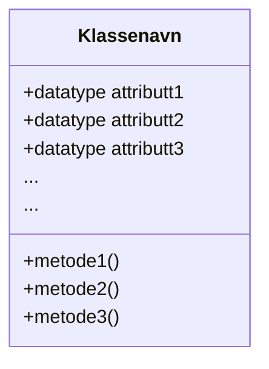
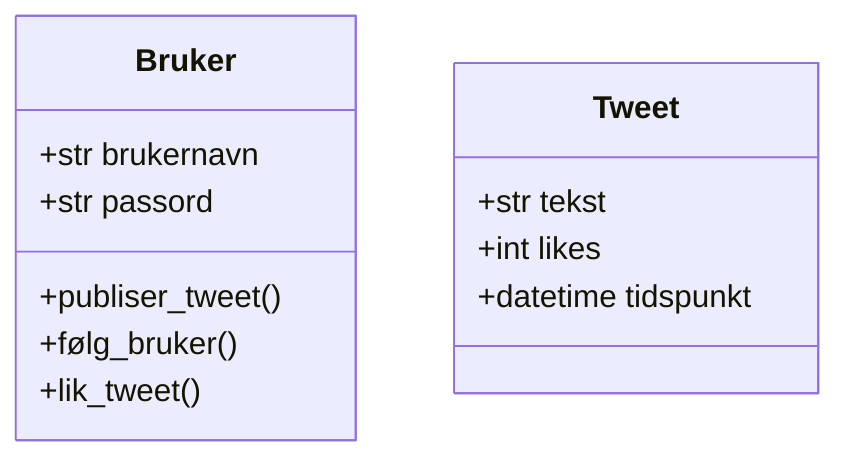

Objektorientert modellering (OOM) brukes for å planlegge og strukturere programmer på en oversiktlig måte før man begynner å programmere.
I IT2 er målet å forstå hvordan vi kan dele programmene våre opp i objekter som samarbeider.
Rent praktisk skal vi bruke **UML-diagrammer** for å visualisere dette.

## Hva er OOM?

Objektorientert modellering (OOM) går ut på å beskrive og planlegge et prorgam ved hjelp av **objekter** og **klasser**, uten å skrive kode.
Målet er å få oversikt over hvordan systemet skal bygges opp før man begynner å programmere, slik at man kan skrive ryddigere kode som er lettere å vedlikeholde.

Forskjellen på objektorientert modellering og objektorientert programmering

Objektorientert modellering og objektorientert programmering henger tett sammen, men er ikke det samme.

**Objektorientert modellering** brukes i planleggingsfasen.
Her beskriver man hvilke klasser systemet skal bestå av, hvilke attributter og metoder de har, og hvordan klassene henger sammen.
Dette gjøres ofte ved hjelp av UML-diagrammer.

**Objektorientert programmering** handler om å implementere denne modellen i et programmeringsspråk, for eksempel Python eller Java.
Da skriver man faktisk kode som følger strukturen som er planlagt i UML.

Kort sagt kan man si at objektorientert modellering svarer på *hva systemet skal bestå av*, mens objektorientert programmering svarer på *hvordan systemet fungerer i praksis*.

## Sentrale begreper

* **Klasse**: En mal for objekter, for eksempel `Elev`.
* **Objekt**: Et konkret eksemplar av en klasse, for eksempel én bestemt elev.
* **Attributter**: Egenskaper ved en klasse, for eksempel navn og alder.
* **Metoder**: Funksjoner som beskriver hva et objekt kan gjøre.
* **Konstruktør**: En metode som brukes til å opprette nye objekter.

## UML (Unified Modeling Language)

UML er et smodelleringsspråk som brukes til å grafisk beskrive objektorienterte programmer.
UML er ikke et programmeringsspråk, men et hjelpemiddel for planlegging og kommunikasjon.

Det finnes mange forskjellig typer UML-diagrammer.
Noen studenter fra UiO har laget en fin oversikt over de mest brukte: [HOW TO UML-DIAGRAM (UiO)](https://www.uio.no/studier/emner/matnat/ifi/IN1030/v23/materiale-fra-gruppetimer/gruppe-9/how-to-uml-diagram-guide.pdf).

I IT2 holde vi oss til **klassediagramer**.

## UML-klassediagram

Et klassediagram viser:

* Klassenavn
* Attributter
* Metoder

I UML brukes symboler for synlighet:

* `+` betyr public (tilgjengelig utenfra)
* `-` betyr private (kun internt i klassen)

### Eksempel: Twitter

Twitter består av brukere som har forskjellig egenskaper (attributter) og som kan gjøre ting (metoder).
Her er et forslag til klassediagram for en enkel versjon av Twitter, som består av brukere og tweets:

## Forhold mellom klasser

### Arv

Arv betyr at en klasse kan arve egenskaper og metoder fra en annen klasse. For eksempel kan klassen `Elev` arve fra klassen `Person`. Da slipper man å skrive samme kode flere ganger.

### Assosiasjon

Assosiasjon beskriver at klasser har en relasjon til hverandre. For eksempel kan en `Klasse` bestå av mange `Elev`-objekter.

## Sammenheng mellom UML og kode

UML brukes ofte før programmering for å planlegge strukturen:

* Attributter i UML blir variabler i klassen
* Metoder i UML blir metoder i koden
* Arv i UML blir implementert med arv i programmeringsspråket

Dette gjør overgangen fra idé til ferdig program enklere.

## Hvorfor bruke OOM og UML?

* Gir bedre oversikt over systemet
* Gjør koden mer strukturert og gjenbrukbar
* Reduserer feil før programmering starter
* Gjør samarbeid enklere
