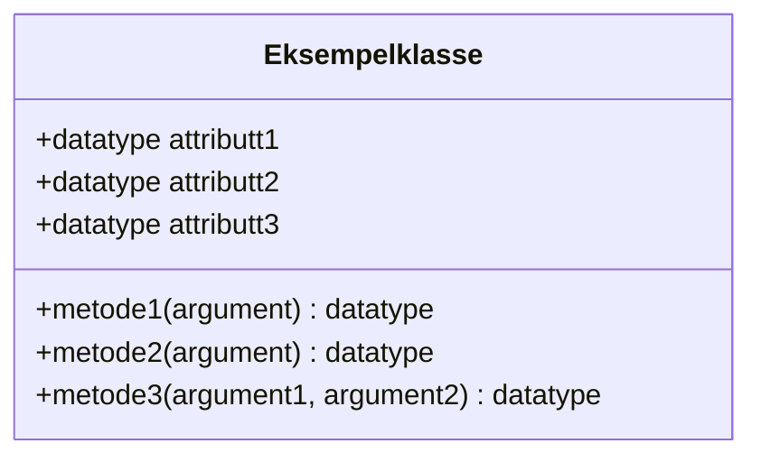
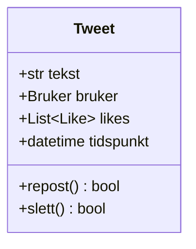
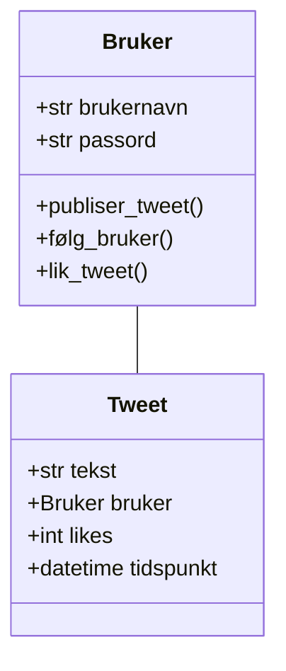
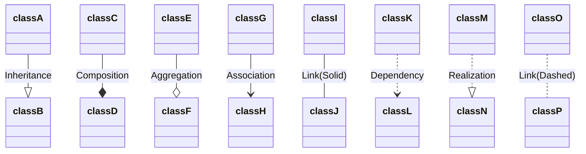
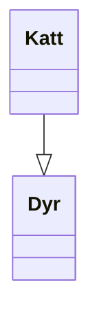
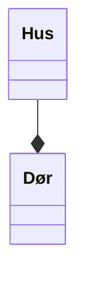
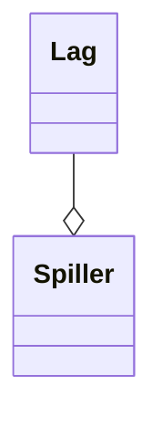

Objektorientert modellering (OOM) er verktøy som brukes for å modellere objektorienterte programmer.
Som oftest dreier det seg om å lage diagrammer som beskriver strukturen i et program.

I IT2 skal vi bruke klassediagrammer som følger [UML-standaren](https://en.wikipedia.org/wiki/Unified_Modeling_Language) for å modellere programmene våre.


<details>
<summary>Forskjellen på objektorientert modellering og objektorientert programmering</summary>

Objektorientert modellering og objektorientert programmering henger tett sammen, men er ikke det samme.

**Objektorientert modellering** brukes som regel i planleggingsfasen.
Her beskriver man hvilke klasser systemet skal bestå av, hvilke attributter og metoder de har, og hvordan klassene henger sammen.

**Objektorientert programmering** handler om å skrive kode som følger modellen som er laget i planleggingsfasen.
Da skriver man faktisk kode som følger strukturen som er planlagt i UML.

Kort sagt kan man si at objektorientert modellering svarer på *hva systemet skal bestå av*, mens objektorientert programmering svarer på *hvordan systemet fungerer i praksis*.

</details>

## Tegne UML-diagrammer i VS Code

1. Last ned utvidelsen [Mermaid Editor](https://marketplace.visualstudio.com/items?itemName=tomoyukim.vscode-mermaid-editor)
2. Lag en ny fil med filendelsen `.mmd` eller `.mermaid`
3. Skriv kode for et diagram
4. Høyreklikk i fila og velg `Mermaid:Generate image`
5. Et bilde med filendelsen `.svg` vil dukke opp i samme mappe som `.mmd`/`.mermaid`-fila.

> [Her er eksempler på mermaid-kode for klassediagrammer.](https://mermaid.ai/open-source/syntax/classDiagram.html)

## Klassediagram

<details>
<summary>Nyttige begreper i objektorientert programmering/modellering</summary>

* **Klasse**: En mal for objekter, for eksempel `Elev`.
* **Objekt**: Et konkret eksemplar av en klasse, for eksempel én bestemt elev.
* **Attributter**: Egenskaper ved en klasse, for eksempel navn og alder.
* **Metoder**: Funksjoner som beskriver hva et objekt kan gjøre.
* **Konstruktør**: En metode som brukes til å opprette nye objekter.

</details>

Klassediagrammer er UML-diagrammer som viser en oversikt over klasser og relasjoner mellom klasser.

### Klasser

I klassediagrammer vises klasser som en boks som inneholder en oversikt over klassenes attributter og metoder.

> `+` betyr *public* og `-` betyr *private*.



<details>
<summary>Mermaid-kode</summary>

```
classDiagram
    class Eksempelklasse{
        +datatype attributt1
        +datatype attributt2
        +datatype attributt3
        ...

        +metode1(argument) datatype
        +metode2(argument) datatype
        +metode3(argument1, argument2) datatype
    }
```

</details>

Diagrammet under viser et eksempel på en klasse for Tweets (poster) på Twitter:



<details>
<summary>Mermaid-kode</summary>

```
classDiagram
    class Tweet{
        +str tekst
        +Bruker bruker
        +int likes
        +datetime tidspunkt

        +repost()
        +slett()
    }
```

</details>

### Relasjoner

Relasjoner mellom klasser vises i klassediagrammer som streker.



<details>
<summary>Mermaid-kode</summary>

```text {2}
classDiagram
    Bruker -- Tweet
    class Bruker{
        +str brukernavn
        +str passord
        +publiser_tweet()
        +følg_bruker()
        +lik_tweet()
    }
    class Tweet{
        +str tekst
        +Bruker bruker
        +int likes
        +datetime tidspunkt
    }
```

</details>

### Relasjonstyper



```text
classDiagram
classA --|> classB : Inheritance
classC --* classD : Composition
classE --o classF : Aggregation
classG --> classH : Association
classI -- classJ : Link(Solid)
classK ..> classL : Dependency
classM ..|> classN : Realization
classO .. classP : Link(Dashed)
```


#### Oversikt

| Relasjon    | Typisk betydning | Eksempel                   | Forklaring                                                                              |
| ----------- | ---------------- | -------------------------- | --------------------------------------------------------------------------------------- |
| Arv         | er-en/er-et      | `Katt` er et `Dyr`         | `Katt` er en *spesialisering av `Dyr`, mens `Dyr` er en *generalisering* av `Katt`.     |
| Komposisjon | Eier             | `Hus` eier en `Dør`        | `Dør` kan ikke eksistere uten `Hus`. Når `Hus` slettes, slettes også `Dør`.             |
| Aggregering | Har              | `Spiller` har et `Lag`     | `Spiller` kan eksitere uten å ha et `Lag`. Når `Lag` slettes, slettes *ikke* `Spiller`. |

#### Arv (Inheritance / Generalization)



```
Katt --|> Dyr
```

**Betydning:**
`Katt` arver fra `Dyr`.

* `Katt` er en *spesialisering* av `Dyr`
* `Dyr` er en *generalisering* av `Dyr`
* `Katt` *arver* attributter og metoder fra `Dyr`
* Representerer et **er-et-**/**er-en-** relasjon, vi kan si at `Katt` *er et* `Dyr`.

#### Komposisjon (Composition)



```
Hus --* Dør
```

* `Hus` eier `Dør`
* `Dør` kan **ikke eksistere uten** `Hus`
* Når `Hus` slettes, slettes også `Dør`

#### Aggregering (Aggregation)



```
Lag --o Spiller
```

* `Lag` har `Spiller`
* `Spiller` kan eksistere uavhengig av `Lag`
* Hvis `Lag` slettes, slettes *ikke* `Spiller`

<details>
<summary>KI-forklaring av flere relasjonstyper</summary>

## 4. Association (Assosiasjon)

```
classG --> classH
```

**Generell relasjon mellom to klasser**

* `classG` kjenner til eller bruker `classH`
* Pilen viser navigerbarhet
* Ingen eierskap eller livssyklus implisert

**Eksempel:**
`Order --> Customer`

---

## 5. Link (Solid linje)

```
classI -- classJ
```

**Uspesifisert assosiasjon**

* Klassene er relatert
* Ingen retning eller semantikk angitt
* Brukes ofte i forenklede diagrammer

---

## 6. Dependency (Avhengighet)

```
classK ..> classL
```

**Svak og midlertidig relasjon**

* `classK` bruker `classL`
* Ofte via:

  * metodeparametere
  * lokale variabler
  * statiske metodekall
* Endringer i `classL` kan påvirke `classK`

**Eksempel:**
`ReportService ..> PDFGenerator`

---

## 7. Realization (Realisering)

```
classM ..|> classN
```

**Implementasjon av interface**

* `classN` er et interface
* `classM` implementerer kontrakten
* Brukes i objektorientert design

**Eksempel:**
`MySqlRepository ..|> Repository`

---

## 8. Link (Dashed / stiplet linje)

```
classO .. classP
```

**Uformell eller konseptuell relasjon**

* Ikke like strengt definert i UML
* Brukes ofte for:

  * konseptuelle koblinger
  * annotasjoner
  * høy-nivå-relasjoner

I strenge UML-diagrammer erstattes denne ofte av **Dependency**.


</details>
