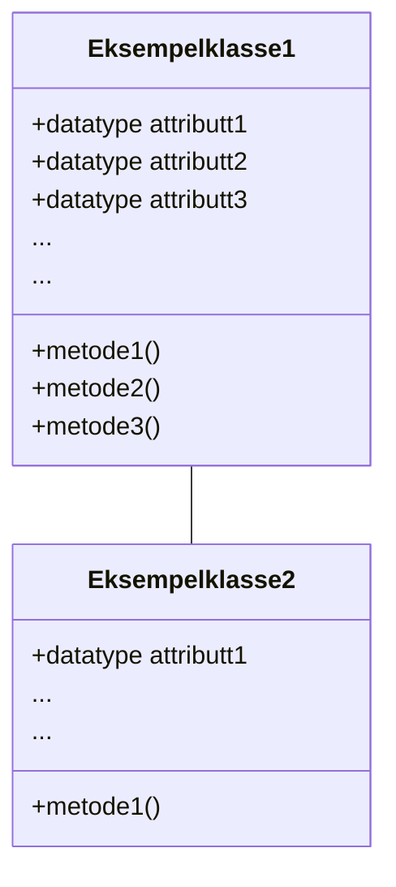
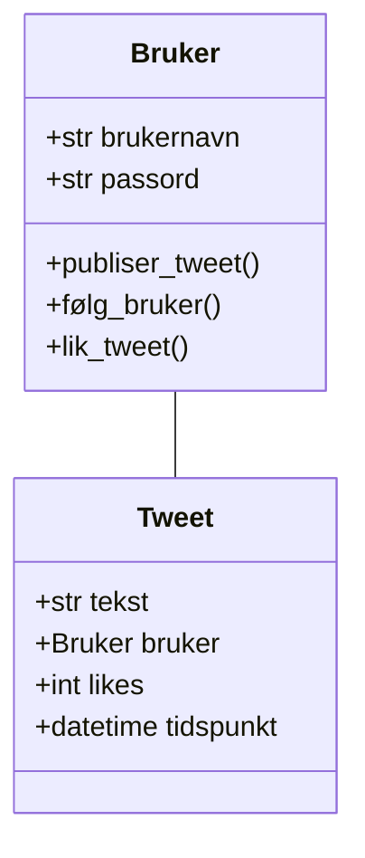

Objektorientert modellering (OOM) er verktøy som brukes for å modellere objektorienterte programmer.
Som oftest dreier det seg om å lage diagrammer som beskriver strukturen i et program.

I IT2 skal vi bruke klassediagrammer som følger [UML-standaren](https://en.wikipedia.org/wiki/Unified_Modeling_Language) for å modellere programmene våre.

Forskjellen på objektorientert modellering og objektorientert programmering

Objektorientert modellering og objektorientert programmering henger tett sammen, men er ikke det samme.

**Objektorientert modellering** brukes som regel i planleggingsfasen.
Her beskriver man hvilke klasser systemet skal bestå av, hvilke attributter og metoder de har, og hvordan klassene henger sammen.

**Objektorientert programmering** handler om å skrive kode som følger modellen som er laget i planleggingsfasen.
Da skriver man faktisk kode som følger strukturen som er planlagt i UML.

Kort sagt kan man si at objektorientert modellering svarer på *hva systemet skal bestå av*, mens objektorientert programmering svarer på *hvordan systemet fungerer i praksis*.

## Klassediagram

Nyttige begreper i objektorientert programmering/modellering

* **Klasse**: En mal for objekter, for eksempel `Elev`.
* **Objekt**: Et konkret eksemplar av en klasse, for eksempel én bestemt elev.
* **Attributter**: Egenskaper ved en klasse, for eksempel navn og alder.
* **Metoder**: Funksjoner som beskriver hva et objekt kan gjøre.
* **Konstruktør**: En metode som brukes til å opprette nye objekter.

Klassediagrammer viser klasser med tilhørende attributter og metoder.

> `+` betyr *public* og `-` betyr *private*.

### Eksempel: Twitter

Twitter består av brukere som har forskjellig egenskaper (attributter) og som kan gjøre ting (metoder).
Her er et forslag til klassediagram for en enkel versjon av Twitter, som består av brukere og tweets:

## Forhold mellom klasser

### Arv

Arv betyr at en klasse kan arve egenskaper og metoder fra en annen klasse. For eksempel kan klassen `Elev` arve fra klassen `Person`. Da slipper man å skrive samme kode flere ganger.

### Assosiasjon

Assosiasjon beskriver at klasser har en relasjon til hverandre. For eksempel kan en `Klasse` bestå av mange `Elev`-objekter.

## Hvorfor bruke OOM og UML?

* Gir bedre oversikt over systemet
* Gjør koden mer strukturert og gjenbrukbar
* Reduserer feil før programmering starter
* Gjør samarbeid enklere
