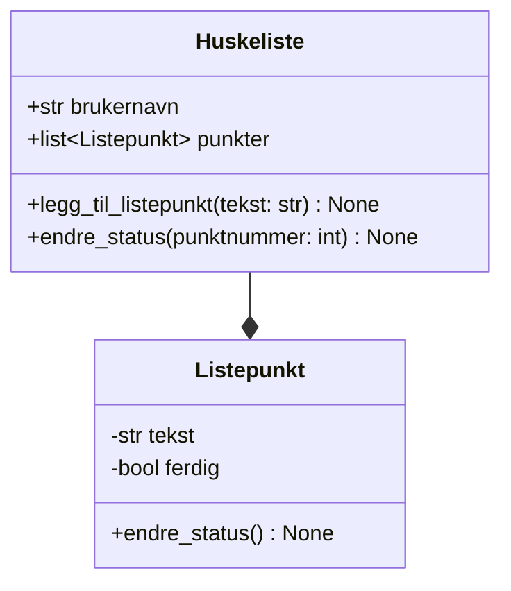

## Klassediagram



<details>
<summary>Mermaid-kode</summary>


</details>

## Oppgave 1 - Klasser i Python

Lag (*implementer*) klassene `Huskeliste` og `Listepunkt` i filen `huskeliste.py`.

<details>
<summary>Tips</summary>

```python
class Huskeliste:
    def __init__(self, brukernavn: str):
        ...

    def legg_til_listepunkt(self, tekst: str):
        ...

    def endre_status(self, punktnummer: int):
        ...

class Listepunkt:
    def __init__(self, tekst: str):
        ...

    def endre_status(self):
        ...
```

</details>

<details>
<summary>Løsningsforslag</summary>

```python
class Huskeliste:
    def __init__(self, brukernavn):
        self.brukernavn: str = brukernavn
        self.punkter: list[Listepunkt] = []

    def legg_til_listepunkt(self, tekst: str):
        nytt_punkt = Listepunkt(tekst)
        self.punkter.append(nytt_punkt)

    def endre_status(self, punktnummer: int):
        self.punkter[punktnummer].endre_status()

class Listepunkt:
    def __init__(self, tekst: str):
        self.tekst: str = tekst
        self.ferdig: bool = False

    def endre_status(self):
        self.ferdig = not self.ferdig # sett self.ferdig til det motsatte
```

</details>

## Oppgave 2 - Vis gjøremål i HTML

1. Lag en ny fil `app.py`
2. Importer klassen `Huskeliste` fra filen `huskeliste.py`.

<details>
<summary></summary>

```python {1}
from huskeliste import Huskeliste
```

</details>

3. Opprett et huskeliste-objekt.

<details>
<summary></summary>

```python {2}
from huskeliste import Huskeliste
min_liste = Huskeliste("thorcc")
```

</details>

4. Legg til to listepunkt med valgfri tekst.

<details>
<summary></summary>

```python {4-5}
from huskeliste import Huskeliste
min_liste = Huskeliste("thorcc")

min_liste.legg_til_listepunkt("Lage ferdig huskeliste-appen")
min_liste.legg_til_listepunkt("Gjøre IT-leksa")
```

</details>

5. Importer `Flask`, `render_template` fra `flask`-modulen øverst i `app.py`.

<details>
<summary></summary>

```python {5-6}
from flask import Flask, render_template
from huskeliste import Huskeliste
min_liste = Huskeliste("thorcc")

min_liste.legg_til_listepunkt("Lage ferdig huskeliste-appen")
min_liste.legg_til_listepunkt("Gjøre IT-leksa")
```

</details>

6. Opprett en et objekt av `Flask`-klassen (*opprett en flask-app*).

<details>
<summary></summary>

```python {8}
from flask import Flask, render_template
from huskeliste import Huskeliste
min_liste = Huskeliste("thorcc")

min_liste.legg_til_listepunkt("Lage ferdig huskeliste-appen")
min_liste.legg_til_listepunkt("Gjøre IT-leksa")

app = Flask(__name__)
```

</details>

7. Start appen ved å kjøre metoden `run` på appen, send inn `debug=True` som argument.

<details>
<summary></summary>

```python {10}
from flask import Flask, render_template
from huskeliste import Huskeliste
min_liste = Huskeliste("thorcc")

min_liste.legg_til_listepunkt("Lage ferdig huskeliste-appen")
min_liste.legg_til_listepunkt("Gjøre IT-leksa")

app = Flask(__name__)

app.run(debug=True)
```

</details>

8. Legg til en rute til `/` som returnerer `Antall gjøremål: ANTALL`

<details>
<summary></summary>

```python {10-12}
from flask import Flask, render_template
from huskeliste import Huskeliste
min_liste = Huskeliste("thorcc")

min_liste.legg_til_listepunkt("Lage ferdig huskeliste-appen")
min_liste.legg_til_listepunkt("Gjøre IT-leksa")

app = Flask(__name__)

@app.get("/")
def rute_index():
    return f"Antall gjøremål: {len(min_liste.punkter)}"

app.run(debug=True)
```

</details>

9. Lag en ny mappe `templates` i samme mappe som `app.py` og lag filen `index.html` i `templates`-mappen.

10. Returner
