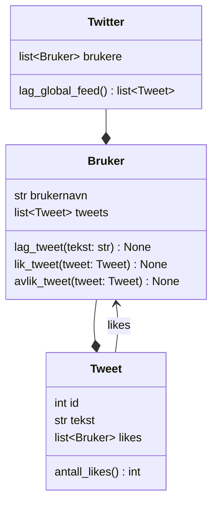
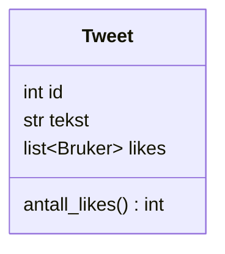
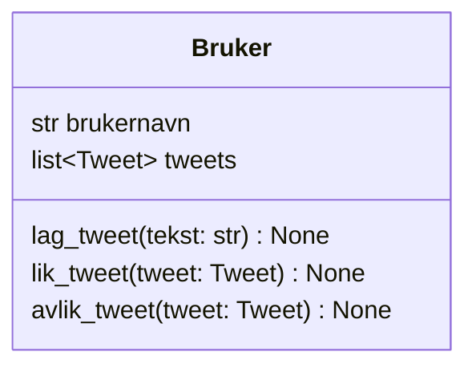
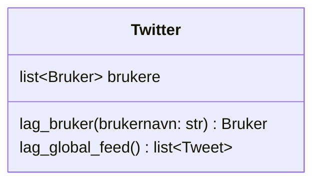

## Klasser



<details>
<summary>Mermaid-kode</summary>

```text
classDiagram
    Twitter --* Bruker
    Bruker --* Tweet
    Tweet --> Bruker : likes

    class Twitter {
        list~Bruker~ brukere
        lag_global_feed() list~Tweet~
    }

    class Bruker {
        str brukernavn
        list~Tweet~ tweets
        lag_tweet(tekst: str) None
        lik_tweet(tweet: Tweet) None
        avlik_tweet(tweet: Tweet) None
    }

    class Tweet {
        int id
        str tekst
        list~Bruker~ likes
        antall_likes() int
    }

```

</details>

### Tweet-klassen



#### Oppgave

Lag klassen `Tweet` i henhold til klassediagrammet.

> For å lage ID-er, kan vi bruke en klassevariabel, som deles av alle som er av samme klasse. Koden under viser hvordan det fungerer i praksis.

<details>
<summary>Pytohn-kode</summary>

```python
class Tweet:
    neste_id = 1 # klassevariabel
    def __init__(self, tekst: str):
        self.tekst = tekst
        self.likes: list[Bruker] = []
        self.id = neste_id
        Tweet.neste_id += 1 # øker klassevariabelen neste_id med 1

    def antall_likes(self):
        return len(self.likes)

```

</details>


### Bruker-klassen




Lag klassen `Bruker` i henhold til klassediagrammet.

<details>
<summary>Python-kode</summary>

```python
class Bruker:
    def __init__(self, brukernavn):
        self.brukernavn = brukernavn
        self.tweets: list[Tweet] = []

    def lag_tweet(self, tekst: str):
        ny_tweet = Tweet(tekst)
        self.tweets.append(ny_tweet)

    def slett_tweet(self, tweet: Tweet):
        self.tweets.remove(tweet)

    def lik_tweet(self, tweet: Tweet):
        tweet.likes.append(self) # legger til brukeren _selv_ i listen over likes til en Tweet

    def avlik_tweet(self, tweet: Tweet):
        tweet.likes.remove(self)
```

</details>

### Twitter-klassen



Lag klassen `Twitter` i henhold til klassediagrammet.

<details>
<summary>Python-kode</summary>

```python
class Twitter:
    def __init__(self):
        self.brukere: list[Bruker] = []

    def lag_bruker(self, brukernavn: str):
        ny_bruker = Bruker(brukernavn)
        self.brukere.append(ny_bruker)
        return ny_bruker

    def lag_global_feed(self):
        alle_tweets = []
        for bruker in self.brukere:
            alle_tweets += bruker.tweets

        alle_tweets.sort(key=attrgetter("id"), reverse=True) # sorterer alle tweets etter id høyest til lavest (reverse=True)
        return alle_tweets

```

</details>
