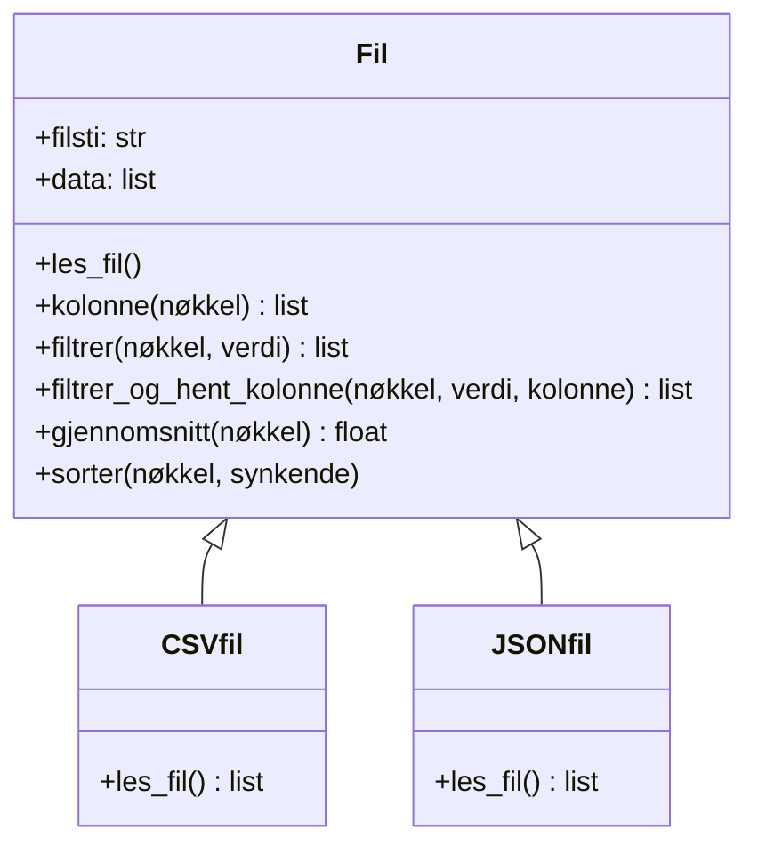

Databehandling handler om å lese, filtrere og analysere data.

Data kommer i mange forksjellige former og filformater.
I IT2 skal vi forholde oss til strukturerte data i CSV- og JSON-filer og data fra API-er.

## CSV

CSV (*Comma-Separated Values*) er et enkelt tekstformat der data er organisert i rader og kolonner, litt som et regneark.
Første rad er ofte overskrifter (kolonnenavn), og de neste radene er dataverdier.

```
navn,fag,karakter,termin
Amelia Hansen,Matematikk,5,1
Benjamin Larsen,Norsk,4,1
Celine Olsen,IT2,6,1
```

> Merk: Selv om formatet heter "comma-separated", brukes noen ganger semikolon (`;`) som skilletegn i norske filer.

## JSON

JSON (*JavaScript Object Notation*) bruker ordbøker og lister for å strukturere data.
En JSON-fil kan inneholde en liste med ordbøker:

```json
[
  {
    "navn": "Skuespill",
    "leder": "Amelia Hansen",
    "antall_medlemmer": 18,
    "klar": false
  },
  {
    "navn": "Dans",
    "leder": "Celine Olsen",
    "antall_medlemmer": 12,
    "klar": false
  }
]
```

Fordelen med JSON er at det støtter nøstede strukturer (ordbøker inne i ordbøker, lister inne i ordbøker osv.), noe CSV ikke gjør like lett.

## Lese CSV-filer

Python har et innebygd bibliotek som heter `csv`. Derfra kan vi bruke `csv.DictReader` for å lese CSV-filer som lister med ordbøker, der nøklene er kolonnenavnene.

```python
import csv

with open("karakterer.csv", encoding="utf-8") as fil:
    leser = csv.DictReader(fil)
    karakterer = list(leser)

print(karakterer[0])
# {'navn': 'Amelia Hansen', 'fag': 'Matematikk', 'karakter': '5', 'termin': '1'}
```

> **OBS:** Alle verdier fra CSV leses som tekst (`str`). Vil du bruke tallverdier i beregninger, må du konvertere med `int()` eller `float()`.

### Eksempel: Finn gjennomsnittskarakter i IT2

```python
import csv

with open("karakterer.csv", encoding="utf-8") as fil:
    leser = csv.DictReader(fil)
    karakterer = list(leser)

it2_karakterer = []
for rad in karakterer:
    if rad["fag"] == "IT2":
        it2_karakterer.append(int(rad["karakter"]))

snitt = sum(it2_karakterer) / len(it2_karakterer)
print(f"Gjennomsnittskarakter i IT2: {snitt:.1f}")
```

## Lese JSON-filer

Python har et innebygd bibliotek som heter `json`. Derfra kan vi bruke `json.load()` for å lese JSON-filer direkte til Python-lister eller -ordbøker.

```python
import json

with open("revyen.json", encoding="utf-8") as fil:
    grupper = json.load(fil)

print(grupper[0])
# {'navn': 'Skuespill', 'beskrivelse': '...', 'leder': 'Amelia Hansen', ...}
```

### Eksempel: Finn gruppen med flest medlemmer

```python
import json

with open("revyen.json", encoding="utf-8") as fil:
    grupper = json.load(fil)

størst = grupper[0]
for gruppe in grupper:
    if gruppe["antall_medlemmer"] > størst["antall_medlemmer"]:
        størst = gruppe

print(f"Gruppen med flest medlemmer er {størst['navn']} med {størst['antall_medlemmer']} medlemmer")
```

### Eksempel: Finn grupper som ikke er klare

```python
import json

with open("revyen.json", encoding="utf-8") as fil:
    grupper = json.load(fil)

ikke_klare = []
for gruppe in grupper:
    if gruppe["klar"] == False:
        ikke_klare.append(gruppe["navn"])

print("Grupper som ikke er klare:", ikke_klare)
```

## Telle antall forekomster med ordbøker

Et vanlig mønster i databehandling er å telle antall forekomster.
For eksempel hvor mange elever som har fått hver karakter, eller hvor mange representanter hvert parti har.

For å få til dette kan vi bruke en ordbok der nøkkelen er kategorien og verdien er antallet.

```python
import csv

with open("karakterer.csv", encoding="utf-8") as fil:
    leser = csv.DictReader(fil)
    karakterer = list(leser)

antall_per_karakter = {}
for rad in karakterer:
    karakter = rad["karakter"]
    if karakter not in antall_per_karakter:
        antall_per_karakter[karakter] = 1
    else:
        antall_per_karakter[karakter] += 1

print(antall_per_karakter)
# {'5': 8, '4': 6, '6': 10, '3': 4, '2': 2}
```

Mønsteret er alltid det samme:
1. Lag en tom ordbok
2. Gå gjennom listen med en for-løkke
3. Hvis nøkkelen ikke finnes: legg den til med verdien `1`
4. Hvis nøkkelen finnes: øk verdien med `1`

## Sortere ordbøker

For å finne f.eks. den mest brukte karakteren kan vi sortere ordboken.
Vi bruker `sorted()` på `ordbok.items()`, som gir en liste med `(nøkkel, verdi)`-par:

```python
sortert = sorted(antall_per_karakter.items(), key=lambda par: par[1], reverse=True)
print(sortert)
# [('6', 10), ('5', 8), ('4', 6), ('3', 4), ('2', 2)]

vanligst = sortert[0]
print(f"Vanligste karakter: {vanligst[0]} ({vanligst[1]} ganger)")
# Vanligste karakter: 6 (10 ganger)
```

`lambda par: par[1]` betyr "sorter etter det andre elementet i hvert par", altså antallet.
`reverse=True` gir synkende rekkefølge, altså høyest antall øverst.


## Vårt eget filbibliotek

I Python er kodene for å lese inn CSV- og JSON-filer litt forskjellig.
CSV-filer krever at vi bruker CSV-modulen og ofte `csv.DictReader`, mens for JSON-filer bruker vi ofte `json.load` fra JSON-modulen.

Nå som vi har lært litt om objektorientert programmering, kan vi lage egne klasser for å forenkle innlesingen.
Da slipper vi huske på de forskjellige modulene og funksjonene/klassene som følger med de.

I denne delen lager vi to klasser `CSVfil` og `JSONfil` som begge arver fra samme superklasse.
Målet med denne koden er å forenkle innlesing av filer ved å gjøre det så likt som mulig uavhengig av filtype.



Klassene `CSVfil` og `JSONfil` har de samme metodene:

| Metode | Beskrivelse |
|--------|-------------|
| `.kolonne(nøkkel)` | Returnerer en liste med alle verdier i en kolonne |
| `.filtrer(nøkkel, verdi)` | Returnerer rader der `rad[nøkkel] == verdi` |
| `.filtrer_og_hent_kolonne(nøkkel, verdi, kolonne)` | Filtrerer og returnerer kun verdier fra én kolonne |
| `.gjennomsnitt(nøkkel)` | Regner ut gjennomsnittet av en tallkolonne |
| `.sorter(nøkkel, synkende)` | Sorterer dataen på plass etter en kolonne |

> Tips: Bruk disse klassene når du løser oppgaver og legg til nye metoder i din egen kode når du kommer bort i noe som klassene ikke kan løse enda.

> **OBS:** `.sorter()` endrer `self.data` permanent – den opprinnelige rekkefølgen er borte etter at metoden er kalt. Vil du beholde originalen, kan du lage en ny metode `sortert()` som returnerer en ny sortert liste i stedet for å endre `self.data`:
>
> ```python
> def sortert(self, nøkkel: str, synkende: bool = False) -> list:
>     return sorted(self.data, key=lambda rad: rad[nøkkel], reverse=synkende)
> ```

### Koden

```python title="filbib.py"
import csv
import json


class Fil:
    """Superklasse for alle fillesere."""

    def __init__(self, filsti: str):
        self.filsti = filsti
        self.data = None

    def les_fil(self):
        """Skal overstyres av subklasser. Returnerer data fra filen."""
        raise NotImplementedError("Bruk subklassene, ikke filklassen direkte.")

    def gjennomsnitt(self, nøkkel: str) -> float:
        """Regner ut gjennomsnittet av tallverdiene i en gitt kolonne."""
        verdier = self.kolonne(nøkkel)
        if len(verdier) == 0:
            return -1
        sum = 0
        for verdi in verdier:
            sum += float(verdi)
        return sum / len(verdier)

    def filtrer(self, nøkkel: str, verdi) -> list:
        """Returnerer rader der rad[nøkkel] == verdi."""
        rader = []
        for rad in self.data:
            if rad[nøkkel] == verdi:
                rader.append(rad)
        return rader

    def filtrer_og_hent_kolonne(self, nøkkel: str, verdi, kolonne: str) -> list:
        """Filtrerer på nøkkel/verdi og returnerer kun verdiene fra én kolonne."""
        rader = self.filtrer(nøkkel, verdi)
        verdier = []
        for rad in rader:
            verdier.append(rad[kolonne])
        return verdier

    def kolonne(self, nøkkel: str) -> list:
        """Returnerer en liste med alle verdiene i en kolonne."""
        verdier = []
        for rad in self.data:
            verdier.append(rad[nøkkel])
        return verdier

    def sorter(self, nøkkel: str, synkende: bool = False):
        """Sorterer self.data på plass etter verdiene i en kolonne."""
        self.data = sorted(self.data, key=lambda rad: rad[nøkkel], reverse=synkende)


class CSVfil(Fil):
    """Leser en CSV-fil og returnerer en liste med ordbøker."""

    def __init__(self, filsti: str):
        super().__init__(filsti)
        self.data = self.les_fil()

    def les_fil(self) -> list[dict]:
        with open(self.filsti, encoding="utf-8") as enkelt_fil:
            csv_leser = csv.DictReader(enkelt_fil)
            return list(csv_leser)


class JSONfil(Fil):
    """Leser en JSON-fil og returnerer innholdet som en liste med ordbøker."""

    def __init__(self, filsti: str):
        super().__init__(filsti)
        self.data = self.les_fil()

    def les_fil(self) -> list:
        with open(self.filsti, encoding="utf-8") as enkeltfil:
            return json.load(enkeltfil)
```

### Eksempel på bruk med CSVfil

```python
from filbib import CSVfil

karakterer = CSVfil("karakterer.csv")

# Hent alle karakterer i én liste
alle_karakterer = karakterer.kolonne("karakter")
print(alle_karakterer)  # ['5', '4', '6', '3', ...]

# Finn gjennomsnittskarakter
snitt = karakterer.gjennomsnitt("karakter")
print(f"Snitt: {snitt:.2f}")
```

### Eksempel med JSONfil

```python
from filbib import JSONfil

revy = JSONfil("revyen.json")

# Hent alle gruppenavn
navn = revy.kolonne("navn")
print(navn)  # ['Skuespill', 'Dans', 'Musikk', ...]

# Hent kun grupper som er klare
klare = revy.filtrer("klar", True)
print(klare)

# Hent bare navnene på de klare gruppene
klare_navn = revy.filtrer_og_hent_kolonne("klar", True, "navn")
print(klare_navn)  # ['Musikk', 'Manus', 'Kostyme og sminke']
```

