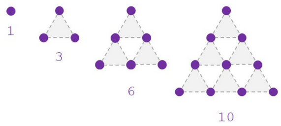
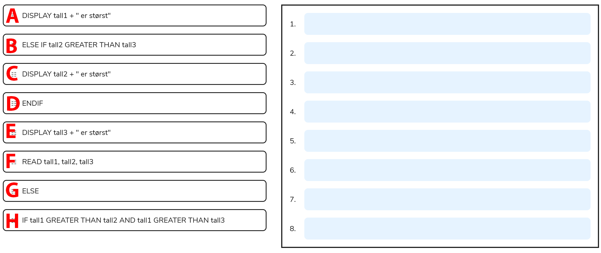

Pseudokode er en måte å beskrive en algoritme eller et program på ved hjelp av naturlig språk.
Det brukes ofte som et verktøy for å planlegge og designe algoritmer før de faktisk blir kodet i et bestemt programmeringsspråk.
De gjør det lettere å kommunisere og samarbeide med andre programmerere, samt å teste og feilsøke algoritmer før de blir kodet.
Og de er en god måte å lære grunnleggende programmeringskonsepter på, da det kan hjelpe deg med å forstå hvordan ulike instruksjoner og logiske uttrykk fungerer sammen for å løse et bestemt problem.

## Eksempel: utregning av utbetaling per avspilling på Spotify

### Med pseudokode

```pseudo
SET land TO READ "Hvilket land er du fra?"
IF land EQUAL TO Norge
    THEN DISPLAY "$0.44 per sang"
ELSE IF land EQUAL TO "Sverige"
    THEN DISPLAY "$0.34 per sang"
ELSE
    THEN DISPLAY "$0.22 per sang"
ENDIF
```

### Med python-kode

```python
land = input("Hvilket land kommer du fra? ")
if land.lower() == "norge":
    print("$0.44 per sang")
elif land.lower() == "sverige":
    print("$0.34 per sang")
else:
    print("$0.22 per sang")
```

## Standard for pseudokode på eksamen

På eksamen forventes det at kandidaten behersker å lese pseudokode skrevet etter denne standarden. Alle nøkkelord skrives med store bokstaver og på engelsk, mens pseudokoden ellers skrives på norsk i oppgavene. Kandidatene har metodefrihet i sitt valg av standard for pseudokode, men det forventes konsekvens. Det forventes også at pseudokode kandidatene leverer oppfyller formålet med pseudokode, bruker naturlig språk og ikke ligger tett opptil syntaks for programkode, men likevel er presis nok til å komplett beskrive logikken i programmet. Alle strukturblokker skal være indentert i pseudokode.

Kandidatene står også fritt til å bruke norsk eller engelsk i sin kode, men det forventes konsekvens.

## Udirs ordliste

Følgende nøkkelord benyttes for å representere struktur (flytkontroll) i pseudokode på eksamen

| nøkkelord                   | beskrivelse                                                                                         |
| --------------------------- | --------------------------------------------------------------------------------------------------- |
| SEQUENCE                    | representerer lineære operasjoner som utføres sekvensielt etter hverandre.                          |
| FUNCTION-RETURN-ENDFUNCTION | representerer en kallbar subrutine med eller uten returverdi.                                       |
| WHILE-ENDWHILE              | er en løkke med en betingelse for å kjøres i begynnelsen av løkken.                                 |
| REPEAT-UNTIL                | er en løkke som kjøres minst en gang, med en betingelse for gjentakelse til slutt.                  |
| FOR-ENDFOR                  | er en løkke som kjøres et visst antall ganger eller over elementer i en variabel eller tilsvarende. |
| IF-THEN-ELSE-ENDIF          | er en valgsetning som endrer flyten i algoritmen.                                                   |
| CASE-OF-OTHERS-ENDCASE      | er en flerveis forgrening av flyten basert på verdien av et uttrykk.                                |
| BEGIN-EXCEPTION-WHEN-END    | er håndtering av unntak i kjøretid.                                                                 |

Følgende nøkkelord benyttes for å representere operasjoner i pseudokode på eksamen

| nøkkelord      | beskrivelse                                                                                                           |
| -------------- | --------------------------------------------------------------------------------------------------------------------- |
| SET TO         | er deklarering eller initialisering av en variabel.                                                                   |
| CALL-RETURNING | er kall til en funksjon eller metode hvor RETURNING er returverdi dersom rutinen, funksjonen eller metoden gir dette. |
| READ           | er lesing eller mottak av input.                                                                                      |
| DISPLAY        | er visning av output til bruker.                                                                                      |
| COMPUTE        | er beregning eller avgjøring av resultat.                                                                             |
| INCREMENT      | er å legge til 1 til en tallvariabel.                                                                                 |
| DECREMENT      | er å trekke fra 1 fra en tallvariabel.                                                                                |

Følgende nøkkelord benyttes for å representere logiske operatorer i pseudokode på eksamen
| nøkkelord | beskrivelse |
| ------------ | ----------------------------------------------------------- |
| EQUAL TO | er evaluering om to uttrykk har lik verdi |
| LESSER THAN | er evaluering om et uttrykk har lavere verdi enn et annet |
| GREATER THAN | er evaluering om et uttrykk har høyere verdi enn et annet |
| NOT | er negering av et logisk uttrykk |
| OR | er en evaluering av minst ett at to logiske sannhetsverdier |
| AND | er en evaluering av to sannhetsverdier |

## Oppgaver

> Oppgavene skal besvares i en fil med navn `oppgaver-pseudokode.md`

### Oppgave 1

> Oppgave 1 fra eksamen H23

Hvilket av følgende er ikke et typisk kjennetegn på pseudokode? Velg riktig alternativ.

- [ ] den har uformell syntaks.
- [ ] den ligner på vanlig menneskespråk.
- [ ] den kan kjøres direkte på en datamaskin.
- [ ] den brukes ofte i planleggingsfasen av programmering.

<details>
<summary>Løsning</summary>

Den kan kjøres direkte på en datamaskin

</details>

### Oppgave 2

> Oppgave 2 fra eksamen V23

Ta utgangspunkt i følgende pseudokode:

```pseudo
SET m TO 3
SET i TO 1
WHILE i GREATER THAN m
  DISPLAY "Lykkelig dag!"
  INCREMENT i
ENDWHILE
```

Hvor mange ganger blir teksten "Lykkelig dag!" skrevet ut?

- [ ] tre ganger
- [ ] to ganger
- [ ] én gang
- [ ] ingen ganger

<details>
<summary>Løsning</summary>

ingen ganger

</details>

### Oppgave 3

> Oppgave 4 fra eksamen H23

Hvilke av de følgende sekvensene med pseudokode skriver ut tallene fra og med 1 til og med 5? Flere alternativer kan være riktige. Velg riktige svar.

```pseudo
1.
SET i TO 1
FOR hver i LESSER OR EQUAL 5
  PRINT i
ENDFOR

2.
SET i TO 1
WHILE i < 5
  PRINT i
  INCREMENT i
ENDWHILE

3.
SET i TO 0
FOR hver i LESSER OR EQUAL 4
  PRINT i+1
ENDFOR

4.
SET i TO 1
WHILE i <= 5
  PRINT i
  INCREMENT i BY 2
ENDWHILE
```

- [ ] 1
- [ ] 2
- [ ] 3
- [ ] 4

<details>
<summary>Løsning</summary>

- [x] 1
- [ ] 2
- [x] 3
- [ ] 4

</details>

### Oppgave 4

> Oppgave 3 fra eksamen V23

Tallene 1, 3, 6, 10, 15, 21 og så videre kalles for trekanttall. De tilsvarer antallet prikker som vil vises i en likesidet trekant når man bruker et grunnleggende trekantmønster for å bygge trekanten. Se illustrasjonen nedenfor:



Den følgende pseudokoden beskriver en funksjon som regner ut og returner trekanttallet nummer n:

```pseudo
FUNCTION trekanttall (n)
  SET tn TO n * (n+1)/2
  RETURN tn
ENDFUNCTION
```

Bruk funksjonen som er beskrevet ovenfor, og skriv pseudokoden til et program som regner sammen og skriver ut totalsummen av de ti første trekanttallene. Bruk dobbelt mellomrom for innrykk i koden der det er aktuelt. Skriv svaret ditt nedenfor.

> Du kan bruke din egen standard for pseudokode, bare den er hensiktsmessig.

<details>
<summary>Løsningsforslag</summary>

```pseudo
SET total TO 0
SET tall TO 1
FOR hver tall LESSER OR EQUAL 10
  SET total TO total + trekanttall(tall)
DISPLAY total
```

</details>


### Oppgave 5

> Oppgave 5 fra eksamen V23

Nedenfor finner du flere linjer med pseudokode. Sorter linjene i riktig rekkefølge, slik at det blir pseudokoden til et program som skal finne det største tallet av tre tall. Tips: Linjene med pseudokode har ikke innrykk/indentering.



Eksempel på svar:

```pseudo
1-G
2-A
3-D
...
```

<details>
<summary>Løsning</summary>

```pseudo
1-F
2-H
3-A
4-B
5-C
6-G
7-E
8-D
```

</details>

### Oppgave 6

> Oppgave 6 fra eksamen H23

Du får i oppgave å finne det nest største tallet i en liste (array) med tall. Dersom det finnes flere like tall som er størst, skal ingen av disse regnes som nest størst. Under finner du fire alternative løsninger for denne oppgaven skrevet i pseudokode. Hvilke to løsninger er riktige?

```pseudo
1
SET størst TO negativt uendelig tall
FOR hvert tall i listen
  IF tall GREATER THAN størst
    SET størst TO tall
  ENDIF
ENDFOR
Fjern størst fra listen
SET nestStørst TO negativt uendelig tall
FOR hvert tall i listen
  IF tall GREATER THAN nestStørst
    SET nestStørst TO tall
  ENDIF
ENDFOR
DISPLAY nestStørst

2
SET størst TO første tall i listen
SET nestStørst TO andre tall i listen
IF nestStørst GREATER THAN størst
  Bytt størst og nestStørst
ENDIF
FOR hvert tall i listen med start fra tredje tall
  IF tall GREATER THAN størst
    SET nestStørst TO størst
    SET størst TO tall
  ELSEIF tall GREATER THAN nestStørst AND tall NOT EQUAL TO størst
  SET nestStørst TO tall
  ENDIF
ENDFOR
DISPLAY nestStørst

3
SET størst TO negativt uendelig tall
SET nestStørst TO negativt uendelig tall
FOR hvert tall i listen
  IF tall GREATER THAN størst
    SET nestStørst TO størst
    SET størst TO tall
  ELSEIF tall GREATER THAN nestStørst
    SET nestStørst TO tall
  ENDIF
ENDFOR
DISPLAY nestStørst

4
Sorter listen i synkende rekkefølge
FOR hvert tall i listen
    IF tall NOT EQUAL TO neste tall i listen
        DISPLAY neste tall i listen
        avbryt for-løkken
    ENDIF
ENDFOR
```

Velg de to riktige løsningene.

- [ ] 1
- [ ] 2
- [ ] 3
- [ ] 4

<details>
<summary>Løsning</summary>

- [ ] 1
- [x] 2
- [ ] 3
- [x] 4

</details>


### Oppgave 7

> Oppgave 7 fra eksamen H23

Elementene i en indeksert variabel (liste/array) skal sorteres i stigende rekkefølge etter følgende algoritme: Man sammenligner hvert element fra venstre til høyre i listen med neste element, og hvis elementet er større enn neste element, bytter de plass. Deretter går man videre til neste element og sammenligner på nytt frem til hele listen er gjennomgått. Dette gjentas til hele listen gjennomgås uten at det forekommer noen ombyttinger.

Under finner du deler av pseudokoden for denne algoritmen. Her er a en liste med n elementer, og a[ i ] er elementet på plass i i listen.

```pseudo
SET i TO 0
FOR hver i LESSER THAN n - 1
  IF a[i] GREATER THAN a[i+1]
    CALL byttPlass()
  ENDIF
ENDFOR
```

> Presisering: byttPlass() er en funksjon som bytter plass på to naboelementer i listen.

1. Hva blir innholdet i listen etter at vi har kjørt programmet representert ved pseudokoden over for listen a = [8, 5, 2, 6, 12], som har n = 5 elementer?
   Velg riktig svar.

- [ ] `[ 5, 8, 2, 6, 12 ]`
- [ ] `[ 5, 2, 8, 6, 12 ]`
- [ ] `[ 5, 2, 6, 8, 12 ]`
- [ ] `[ 2, 5, 6, 8, 12 ]`

2. Utvid pseudokoden slik at programmet den representerer, sorterer ferdig listen a i stigende rekkefølge etter altgoritmen som er vist øverst.
   Forklar endringene du gjør.
   Obs! Du må også lage pseudokode for funksjonen `byttPlass()`.

3. Implementer pseudokoden fra punkt b i ditt programmeringsspråk. Listen skal leses inn automatisk, og den ferdig sorterte listen skal skrives til konsollet eller vises i programmet.

<details>
<summary>Løsningsforslag</summary>
1.

- [ ] `[ 5, 8, 2, 6, 12 ]`
- [ ] `[ 5, 2, 8, 6, 12 ]`
- [x] `[ 5, 2, 6, 8, 12 ]`
- [ ] `[ 2, 5, 6, 8, 12 ]`

2. 

```pseudo
FUNCTION byttPlass(liste, i, j)
  SET midlertidig TO a[i]
  SET a[i] TO a[j]
  set a[j] TO midlertidig
ENDFUNCTION


SET bytta TO TRUE
WHILE bytta
  SET bytta TO FALSE
  SET i TO 0
  FOR hver i LESSER THAN n - 1
    IF a[i] GREATER THAN a[i+1]
      CALL byttPlass(a, i, i + 1)
      SET bytta TO TRUE
    ENDIF
  ENDFOR
ENDWHILE
```

```pseudo
Jeg har laget en while-løkke rundt for-løkken.
While-løkken kjører helt til for-løkken har
gått én runde uten at noen tall bytter plass.
```

3.

```python
def bytt_plass(liste, i, j):
    midlertidig = liste[i]
    liste[i] = liste[j]
    liste[j] = midlertidig

bytta = True
while bytta:
    bytta = False
    for i in range(len(a) - 1):
        if a[i] > a[i + 1]:
            bytt_plass(a, i, i + 1)
            bytta  = True

print(a)
```

</details>