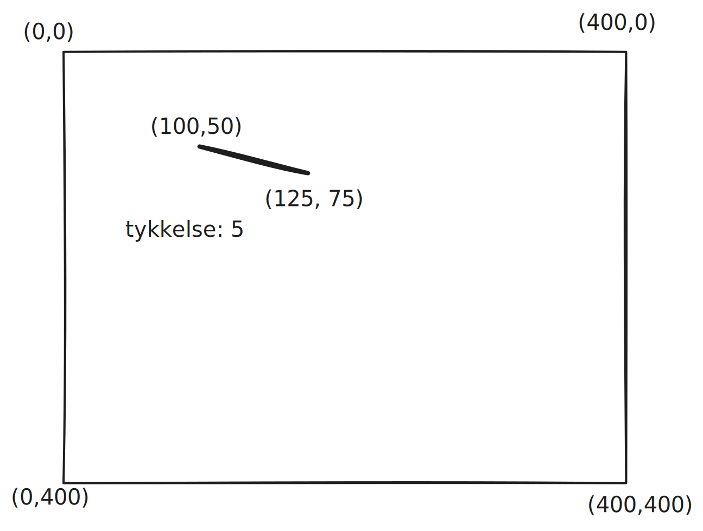

## Koordinatsystem


## Figurer

### Rektangler

**Med fyll**

```python
pygame.draw.rect(overflate, farge, (x, y, bredde, høyde))
pygame.draw.rect(self.screen, "black", (100, 50, 125, 75))
```


**Uten fyll**

```python
pygame.draw.rect(overflate, farge, (x, y, bredde, høyde), tykkelse)
pygame.draw.rect(self.screen, "black", (100, 50, 125, 75), 5)
```


### Linjer

```python
pygame.draw.line(overflate, farge, (start_x, start_y), (slutt_x, slutt_y), tykkelse)
pygame.draw.line(self.screen, "black", (100, 50), (125, 75), 5)
```




## Sprites

## Bilder

## Tekst