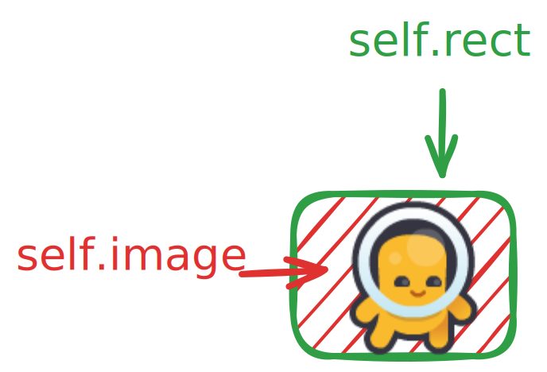
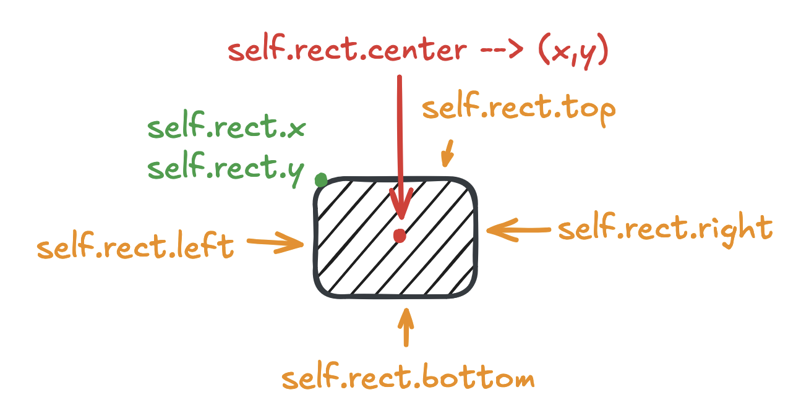

`Sprite` er en klasse for synlige spillobjekter i Pygame.
Sprites kan lages ved å opprette klasser som arver Sprite-klassen, som ligger i `pygame.sprite.Sprite`.

En sprites må ha atributtene `self.image` og `self.rect`, og kan ha metoden `update` for å oppdatere figurene tilstand.



## image

Attributten `self.image` må være av datatypen `pygame.Surface`.
En `Surface` representerer et bilde i Pygame.


## rect



## Eksempel

```python
class Ball(pygame.sprite.Sprite):
    def __init__(self, x: int, y:int, width: int, height: int, color: str) -> None:
        super().__init__()
        self.image = pygame.Surface((width, height), pygame.SRCALPHA)
        self.rect = self.image.get_rect()
        self.rect.x = x
        self.rect.y = y
        self.speed_x = 1
        self.speed_y = -1
        self.color = color

    def update(self):
        self.rect.x += self.speed_x
        self.rect.y += self.speed_y

        if self.rect.right > WIDTH or self.rect.left < 0:
            self.speed_x *= -1
            self.color = pygame.Color(randint(0,255), randint(0,255), randint(0,255))
        if self.rect.bottom > HEIGHT or self.rect.top < 0:
            self.speed_y *= -1
            self.color = pygame.Color(randint(0,255), randint(0,255), randint(0,255))

        pygame.draw.circle(self.image, self.color, (self.rect.width // 2, self.rect.height // 2), self.rect.width // 2)

    def accelerate(self):
        self.speed_x += 1
        self.speed_y += 1

    def brake(self):
        self.speed_x -= 1
        self.speed_y -= 1
```

<details>

<summary>Eksempel på bruk av sprite i en større kode</summary>

```python
import pygame
from random import randint

# Constants
FPS = 60
WIDTH = 800
HEIGHT = 600

class Ball(pygame.sprite.Sprite):
    def __init__(self, x: int, y:int, width: int, height: int, color: str) -> None:
        super().__init__()
        self.image = pygame.Surface((width, height), pygame.SRCALPHA)
        self.rect = self.image.get_rect()
        self.rect.x = x
        self.rect.y = y
        self.speed_x = 1
        self.speed_y = -1
        self.color = color

    def update(self):
        self.rect.x += self.speed_x
        self.rect.y += self.speed_y

        if self.rect.right > WIDTH or self.rect.left < 0:
            self.speed_x *= -1
            self.color = pygame.Color(randint(0,255), randint(0,255), randint(0,255))
        if self.rect.bottom > HEIGHT or self.rect.top < 0:
            self.speed_y *= -1
            self.color = pygame.Color(randint(0,255), randint(0,255), randint(0,255))

        pygame.draw.circle(self.image, self.color, (self.rect.width // 2, self.rect.height // 2), self.rect.width // 2)

    def accelerate(self):
        self.speed_x += 1
        self.speed_y += 1

    def brake(self):
        self.speed_x -= 1
        self.speed_y -= 1

class Game:
    def __init__(self) -> None:
        pygame.init()
        self.clock = pygame.time.Clock()
        self.screen = pygame.display.set_mode((WIDTH, HEIGHT))
        pygame.display.set_caption("GAME TITLE")

        # Game state
        self.running = True

        # Sprite groups
        self.sprites = pygame.sprite.Group()
        self.ball = Ball(100,100, 25,25, "blue")
        self.sprites.add(self.ball)
    
    def handle_events(self) -> None:
        for event in pygame.event.get():
            if event.type == pygame.QUIT:
                self.running = False
        
        # Key pressed
        keys = pygame.key.get_pressed()
        # if keys[pygame.K_UP]:
        #     print("UP button pressed")
        if keys[pygame.K_UP]:
            self.ball.accelerate()
            print("speed up")
        if keys[pygame.K_DOWN]:
            self.ball.brake()
            print("speed down")
        # if keys[pygame.K_w]:
        #     print("W button pressed")

        # Mouse events
        # left, middle, right = pygame.mouse.get_pressed()
        # mouse_x, mouse_y = pygame.mouse.get_pos()
        # if left:
        #     print(f"left button clicked: ({mouse_x},{mouse_y})")

    def update(self) -> None:
        self.sprites.update()

    def draw(self) -> None:
        self.screen.fill("white")
        self.sprites.draw(self.screen)

        pygame.display.flip()
    
    def run(self) -> None:
        while self.running:
            self.handle_events()
            self.update()
            self.draw()
            self.clock.tick(FPS)
        pygame.quit()

if __name__ == "__main__":
    game = Game()
    game.run()
```

</details>
