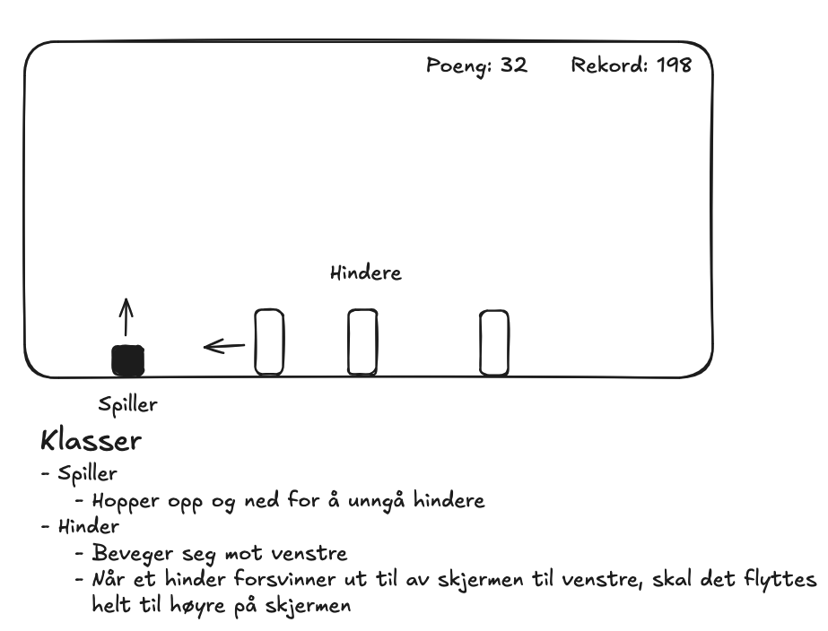

# IT2 - Spillprosjekt

**Lag et spill med Pygame.**

Tema for spillet er valgfritt.
Hvis du er usikker, kan du for eksempel lage din egen versjon av [Googles dinosaur-spill](https://trex-runner.com/).

- **Frist**: Torsdag 22. januar klokka 23:59
- **Tilbakemelding**: Grad av måloppnåelse (lav/middels/høy)
- **Vurdering**: For at prosjektet skal telle på standpunktkarakter må spillet og koden presenteres i en muntlig presentasjon.
- **Valgfri presentasjon**: ~5 min presentasjon 23. januar eller 30. januar

## Arbeidsmetodikk

I arbeidet med dette prosjektet skal du jobbe *smidig*.
Det vil si at du skal jobbe i runder på 90 min (2x45), der du legger til litt og litt funksjonalitet.
Etter hver runde skal du vise arbeidet ditt og få tilbakemelding.

## Forslag til plan

### Runde 1 - planlegging og startkode

Tegn en enkel skisse av spillet ditt i [excalidraw](https://excalidraw.com/) og finn ut hvilke figurer (klasse) spillet skal inneholde, og hva figurene skal gjøre (metoder).

Eksempel på skisse:

### Runde 2 - Klasser

Lag klasser for figurene.
Foreløpig kan klassene være ganske enkle, du kan for eksempel prøve å få til enkel bevegelse.

### Runder 3++

Hør på tilbakemeldingene og legg til til mer på spillet ditt.
Det kan for eksempel være:

- Input fra tastatur/mus
- Beregning av poeng
- Kollisjoner
