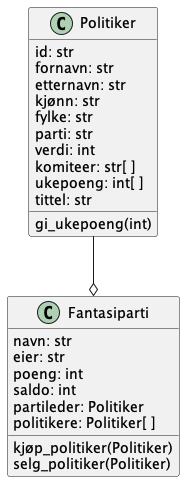

## Regler / idé

> [Fantasy Premier League](https://fantasy.premierleague.com) med politikere og partier.

Spillere oppretter fantasipartier og kjøper og selger politikere.
Hver fredag får politikerne poeng basert på hva som har skjedd i nyhetsbildet den siste uken.
Summen av politiker-poengene på et fantasiparti utgjør ukespoengene for en spiller.

## Klasser

I første omgang skal spillet bestå av to klasser, `Politiker` og `Fantasiparti`.

