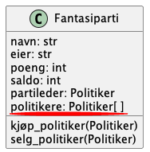
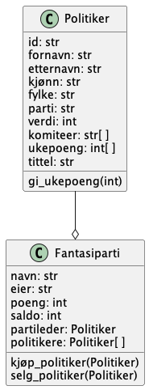

I spillet Stortinget-fantasy skal brukere kunne opprette egne fantasipartier som består av ekte politikere.
En måte dette kan løses på i koden er at hvert fantasiparti har en liste med politikere.

Klassen `Fantasiparti` har en attributt `politikere` som er en liste med politikerobjekter som representerer politikerne.
En slik relasjon kalles en _assosiasjon_.

> `Fantasiparti` har også attributten `partileder` som gjør at `Fantasiparti` og `Politiker` faktisk har to assosiasjoner.

I UML modelleres assosiasjoner med en strek som har en diamant i enden med klassen som har objekter av en annen klasse (opprinnelig fra det engelske verbet _to have_).
I vårt tilfelle, med fantasiparti og politikere, sier vi at fantasipartier _har_ politikere, dermed skal diamanten være i enden ved fantasiparti-klassen.

