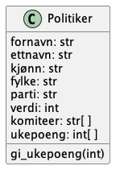

# Data som objekter

## Innhenting av data

Stortinget har en tjeneste for åpne data ([data.stortinget.no](https://data.stortinget.no/)), denne kan vi bruke for å hente informasjon om hva som skjer på stortinget.
I første omgang skal vi bruke listen med representanter: [https://data.stortinget.no/eksport/dagensrepresentanter?format=json](https://data.stortinget.no/eksport/dagensrepresentanter?format=json).

> [Her er listen i JSON-format: representanter.json](https://raw.githubusercontent.com/thorcc/IT2-nettbok/main/pages/apputvikling/vedlegg/representanter.json) - Last ned denne

> Medlemmene i regjeringen - statsråder og statsministeren - er ikke representanter på stortinget.
> De må lastes inn fra en annen fil som du finnner her: [regjering.json](https://data.stortinget.no/eksport/regjering?format=json)

```python filename="spill.py"
import json # øverst i python-fila

with open("representanter.json", "r", encoding="utf-8") as fil:
    data = json.load(fil)
politikere_data = data["dagensrepresentanter_liste"]

```
<details>
    <summary>Hele koden til nå</summary>

```python filename="spill.py" {3, 11-13} showLineNumbers
import os
import platform
import json

def rens_terminal():
    if platform.system == "Windows":
        os.system("cls")
    else:
        os.system("clear")

with open("representanter.json", "r", encoding="utf-8") as fil:
    data = json.load(fil)
politikere_data = data["dagensrepresentanter_liste"]


while True:
    rens_terminal()
    print("-- Stortinget-fantasy --")  
    print("1: Politikeroversikt")
    print("2: Avslutt")
    brukervalg = input(">")

    if brukervalg == "1":
        print("-- Politikeroversikt --")
        input("Trykk enter for å gå tilbake til hovedmenyen")
    elif brukervalg == "2":
        print("Avslutter..")
        break # bryter ut av while-løkken
    else:
        print("Ugyldig valg")

```
</details>

## Politiker-klassen



<details>
    <summary>En politiker-ordbok i JSON-fila</summary>

```json
{
    "respons_dato_tid": "/Date(1707725577041+0100)/",
    "versjon": "1.6",
    "doedsdato": null,
    "etternavn": "Melby",
    "foedselsdato": "/Date(350002800000+0100)/",
    "fornavn": "Guri",
    "id": "GME",
    "kjoenn": 1,
    "fylke": {
    "respons_dato_tid": "/Date(1707696634734+0100)/",
    "versjon": "1.6",
    "historisk_fylke": false,
    "id": "Os",
    "navn": "Oslo"
    },
    "parti": {
    "respons_dato_tid": "/Date(1707696634688+0100)/",
    "versjon": "1.6",
    "id": "V",
    "navn": "Venstre",
    "representert_parti": true
    },
    "vara_representant": false,
    "epost": "Guri.Melby@stortinget.no",
    "fast_vara": null,
    "fast_vara_for": null,
    "komiteer_liste": [
    {
        "respons_dato_tid": "/Date(1707724364244+0100)/",
        "versjon": "1.6",
        "id": "UFK",
        "navn": "Utenriks- og forsvarskomiteen"
    }
    ],
    "vara": null,
    "vara_for": null
}
```

</details>


```python filename="politiker.py"
class Politiker:
    def __init__(self, politiker_ordbok: dict) -> None:
        self.fornavn: str = politiker_ordbok["fornavn"]
        self.etternavn: str = politiker_ordbok["etternavn"]
        self.kjønn: str = "kvinne" if politiker_ordbok["kjoenn"] == 1 else "mann"
        self.fylke: str = politiker_ordbok["fylke"]["navn"]
        self.parti: str = politiker_ordbok["parti"]["navn"]
        self.komiteer = [komite["navn"] for komite in politiker_ordbok["komiteer_liste"]]
        self.ukepoeng: list[int] = []
        self.verdi: int = 1000

    def __str__(self) -> str:
        return f"{self.etternavn}, {self.etternavn} ({self.parti})"
    
    def gi_ukepoeng(self, poeng: int) -> None:
        self.ukepoeng.append(poeng)

```

## Opprette politikere

```python filename="spill.py"
from politiker import Politiker # øverst i python-fila

politikere = []

for politiker_ordbok in politikere_data:
    ny_politiker = Politiker(politiker_ordbok)
    politikere.append(ny_politiker)

```

<details>
    <summary>Hele koden til nå</summary>


```python filename="spill.py" {4, 16-20} showLineNumbers
import os
import platform
import json
from politiker import Politiker

def rens_terminal():
    if platform.system == "Windows":
        os.system("cls")
    else:
        os.system("clear")

with open("representanter.json", "r", encoding="utf-8") as fil:
    data = json.load(fil)
politikere_data = data["dagensrepresentanter_liste"]

politikere = []

for politiker_ordbok in politikere_data:
    ny_politiker = Politiker(politiker_ordbok)
    politikere.append(ny_politiker)

while True:
    rens_terminal()
    print("-- Stortinget-fantasy --")  
    print("1: Politikeroversikt")
    print("2: Avslutt")
    brukervalg = input(">")

    if brukervalg == "1":
        print("-- Politikeroversikt --")
        input("Trykk enter for å gå tilbake til hovedmenyen")
    elif brukervalg == "2":
        print("Avslutter..")
        break # bryter ut av while-løkken
    else:
        print("Ugyldig valg")

```

```python filename="politiker.py" showLineNumbers
class Politiker:
    def __init__(self, politiker_ordbok: dict) -> None:
        self.id: str = politiker_ordbok["id"]
        self.fornavn: str = politiker_ordbok["fornavn"]
        self.etternavn: str = politiker_ordbok["etternavn"]
        self.kjønn: str = "kvinne" if politiker_ordbok["kjoenn"] == 1 else "mann"
        self.fylke: str = politiker_ordbok["fylke"]["navn"]
        self.parti: str = politiker_ordbok["parti"]["navn"]
        self.komiteer = [komite["navn"] for komite in politiker_ordbok["komiteer_liste"]]
        self.ukepoeng: list[int] = []
        self.verdi: int = 1000
        self.tittel: str = politiker_ordbok["tittel"] if "tittel" in politiker_ordbok else "representant"


    def __str__(self) -> str:
        return f"{self.etternavn}, {self.etternavn} ({self.parti})"

    
    def gi_ukepoeng(self, poeng: int) -> None:
        self.ukepoeng.append(poeng)

```
    
</details>

## Politikeroversikt

```python filename="spill.py" {4-5}
...
    if brukervalg == "1":
        print("-- Politikeroversikt --")
        for politiker in politikere:
            print(politiker)
        input("Trykk enter for å gå tilbake til hovedmenyen")
...

```

<details>
    <summary>Hele koden til nå</summary>


```python filename="spill.py" {31-32} showLineNumbers
import os
import platform
import json
from politiker import Politiker

def rens_terminal():
    if platform.system == "Windows":
        os.system("cls")
    else:
        os.system("clear")

with open("representanter.json", "r", encoding="utf-8") as fil:
    data = json.load(fil)
politikere_data = data["dagensrepresentanter_liste"]

politikere = []

for politiker_ordbok in politikere_data:
    ny_politiker = Politiker(politiker_ordbok)
    politikere.append(ny_politiker)

while True:
    rens_terminal()
    print("-- Stortinget-fantasy --")  
    print("1: Politikeroversikt")
    print("2: Avslutt")
    brukervalg = input(">")

    if brukervalg == "1":
        print("-- Politikeroversikt --")
        for politiker in politikere:
            print(politiker)
        input("Trykk enter for å gå tilbake til hovedmenyen")
    elif brukervalg == "2":
        print("Avslutter..")
        break # bryter ut av while-løkken
    else:
        print("Ugyldig valg")

```

```python filename="politiker.py" showLineNumbers
class Politiker:
    def __init__(self, politiker_ordbok: dict) -> None:
        self.id: str = politiker_ordbok["id"]
        self.fornavn: str = politiker_ordbok["fornavn"]
        self.etternavn: str = politiker_ordbok["etternavn"]
        self.kjønn: str = "kvinne" if politiker_ordbok["kjoenn"] == 1 else "mann"
        self.fylke: str = politiker_ordbok["fylke"]["navn"]
        self.parti: str = politiker_ordbok["parti"]["navn"]
        self.komiteer = [komite["navn"] for komite in politiker_ordbok["komiteer_liste"]]
        self.ukepoeng: list[int] = []
        self.verdi: int = 1000
        self.tittel: str = politiker_ordbok["tittel"] if "tittel" in politiker_ordbok else "representant"


    def __str__(self) -> str:
        return f"{self.etternavn}, {self.etternavn} ({self.parti})"

    
    def gi_ukepoeng(self, poeng: int) -> None:
        self.ukepoeng.append(poeng)

```
    
</details>
