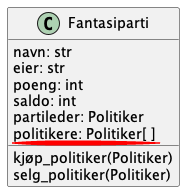

I spillet Stortinget-fantasy skal brukere kunne opprette egne fantasipartier som består av ekte politikere.
En måte dette kan løses på i koden er at hvert fantasiparti har en liste med politikere.




Klassen `Fantasiparti` har en attributt `politikere` som er en liste med politikerobjekter som representerer politikerne.
En slik relasjon kalles en _assosiasjon_.

> `Fantasiparti` har også attributten `partileder` som gjør at `Fantasiparti` og `Politiker` faktisk har to assosiasjoner.

I UML modelleres assosiasjoner med en strek som har en diamant i enden med klassen som har objekter av en annen klasse (opprinnelig fra det engelske verbet _to have_).
I vårt tilfelle, med fantasiparti og politikere, sier vi at fantasipartier _har_ politikere, dermed skal diamanten være i enden ved fantasiparti-klassen.


## Kode

```python filename="politiker.py" showLineNumbers
from politiker import Politiker

class Fantasiparti:
    def __init__(self, navn: str, eier: str) -> None:
        self.navn: str = navn
        self.eier: str = eier
        self.poeng: int = 0
        self.saldo: int = 100_000
        self.partileder: Politiker = None
        self.politikere: list[Politiker] = []

    def kjøp_politiker(self, politiker: Politiker):
        if self.saldo >= politiker.verdi:
            self.politikere.append(politiker)
            self.saldo -= politiker.verdi
    
    def selg_politiker(self, politiker: Politiker):
        if politiker in self.politikere:
            self.politikere.remove(politiker)
            self.saldo += politiker.verdi


    def __str__(self) -> str:
        return f"{self.navn} - {self.eier} ({self.poeng})"
```

```python filename="spill.py" showLineNumbers
import json
from politiker import Politiker
from fantasiparti import Fantasiparti
from funksjoner import *

# 1. Oppsett
# Åpner json-fila og putter alt innholdet i variabelen data:
with open("representanter.json", "r", encoding="utf-8") as fil:
    data = json.load(fil)


representanter = data["dagensrepresentanter_liste"] # henter ut lista med representanter

# Opretter en liste med politiker-objekter (objekter av klassen Politiker):
politikere = []
for politiker_ordbok in representanter:
    ny_politiker = Politiker(politiker_ordbok)
    politikere.append(ny_politiker)


print("-- Velkommen til Stortinget-fantasy --")
print()
print("Hva skal partiet hete?")
navn = input("> ")
print("Hva heter eieren av partiet?")
eier = input("> ")
spillerparti = Fantasiparti(navn, eier)

print()
print("Et nytt politisk parti er stiftet!")
print("Trykk enter for å starte spillet")
input()


while True:
    rens_terminal()
    print(" -- Stortinget-fantasy --")
    print("1: Vis politikeroversikt")
    print("2: Mitt parti")
    print("3: Kjøp politiker")
    print("4: Avslutt")
    brukervalg = input("> ")

    if brukervalg == "1":
        print("politikeroversikt")
        for politiker in politikere:
            print(politiker)
        print("Trykk enter for å gå tilbake til hovedmenyen")
        input()
    elif brukervalg == "2":
        rens_terminal()
        spillerparti.vis_partioversikt()
        print("Trykk enter for å gå tilbake til hovedmenyen")
        input()
    elif brukervalg == "3":
        rens_terminal()
        print("Kjøp politiker")
        print()
        print("Hvem ønsker du å kjøpe? Skriv ID til politiker.")
        politiker_id = input("> ")
        for politiker in politikere:
            if politiker.id == politiker_id:
                spillerparti.kjøp_politiker(politiker)
                break
        print("Trykk enter for å gå tilbake til hovedmenyen")
        input()
    elif brukervalg == "9":
        print("avslutter..")
        break
    else:
        print("Trykk enter for å gå tilbake til hovedmenyen")
        input()
        
print("Takk for nå")

```
