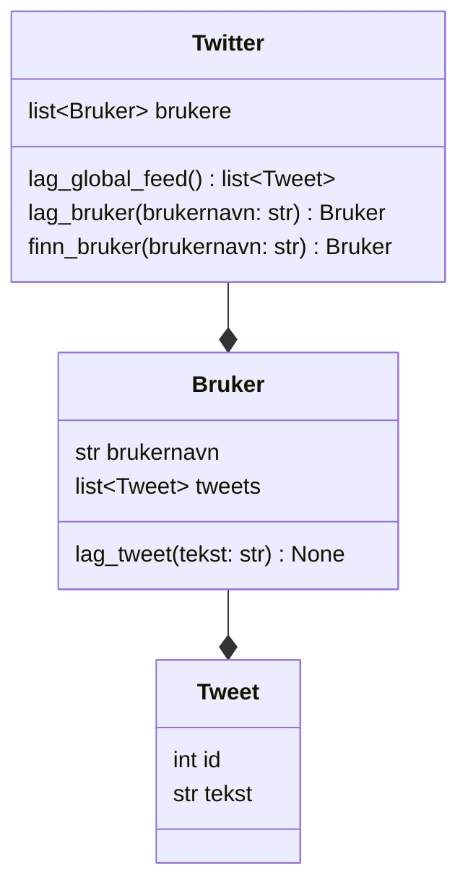
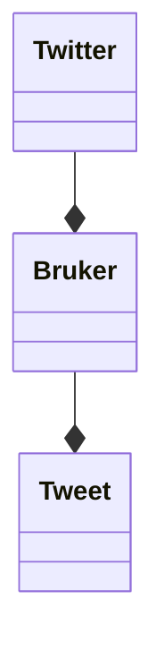

I denne delen lærer du å:

- forklare hva et klassediagram er
- lese et klassediagram og forstå relasjoner mellom klasser
- forklare hvilke objekter som finnes i Twitter-klonen
- forstå hvem som har ansvar for hva i systemet

Denne delen inneholder **ingen programmering**. Målet er å forstå strukturen før vi skriver kode.


## Hva bygger vi?

Vi skal lage en forenklet versjon av Twitter. Systemet skal kunne:

- opprette brukere
- la brukere skrive tweets
- vise en global feed med alle tweets
- vise tweets for én bestemt bruker

For å få til dette trenger vi tre typer objekter:

- Twitter
- Bruker
- Tweet


## Klassediagram

Under ser du klassediagrammet for hele systemet:



<details>
<summary>Mermaid-kode</summary>

```text
classDiagram
    Twitter --* Bruker
    Bruker --* Tweet

    class Twitter {
        list~Bruker~ brukere
        lag_global_feed() list~Tweet~
        lag_bruker(brukernavn: str) Bruker
        finn_bruker(brukernavn: str) Bruker
    }

    class Bruker {
        str brukernavn
        list~Tweet~ tweets
        lag_tweet(tekst: str) None
    }

    class Tweet {
        int id
        str tekst
    }
```

</details>


## Hvordan lese diagrammet

Et klassediagram viser:

- hvilke klasser som finnes
- hvilke egenskaper (variabler) de har
- hvilke metoder (funksjoner) de har
- hvordan klassene henger sammen

### Klasser

I diagrammet ser vi tre klasser:

- `Twitter`
- `Bruker`
- `Tweet`

Hver boks representerer én klasse.

---

### Egenskaper

Egenskaper er variabler som tilhører objekter av klassen.

Eksempel:
- `Bruker` har egenskapen `brukernavn`
- `Tweet` har egenskapene `id` og `tekst`
- `Twitter` har en liste med `Bruker`-objekter

---

### Metoder

Metoder er funksjoner som tilhører klassen.

Eksempel:
- `Bruker.lag_tweet()` lager en ny tweet
- `Twitter.finn_bruker()` finner en bruker basert på brukernavn
- `Twitter.lag_global_feed()` samler alle tweets i systemet

---

## Relasjoner mellom klasser

Strekene i klassediagrammet viser relasjoner mellom klassene.



```text
Twitter --* Bruker
Bruker --* Tweet
```


Dette betyr:

- Ett `Twitter`-objekt har mange `Bruker`-objekter
- Ett `Bruker`-objekt har mange `Tweet`-objekter

Disse relasjoene er **komposisjoner**:
- Tweets eksisterer som en del av en bruker
- Brukere eksisterer som en del av Twitter-systemet

## Ansvarsfordeling

I programmet vårt skal vi ha denne ansvarsfordelingen:

- `Tweet` - skal lagre informasjon om én tweet
- `Bruker` - skal eie tweets og kunne lage nye tweets
- `Twitter` - skal holde oversikt over alle brukere og samle tweets til en global feed

Målet med denne ansvarsfordelingen er at det skal gjøre koden enklere å forstå og enklere å utvide.

## Neste del

I neste del skal vi lage den første klassen i kode: `Tweet`.
