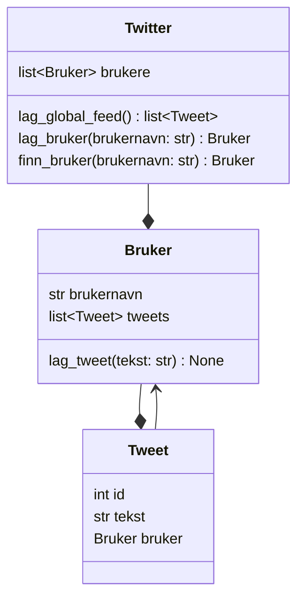
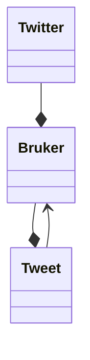

I dette kapittelet skal vi skal lage en forenklet versjon av Twitter.
Vår versjon skal kunne:

- opprette brukere
- la brukere skrive tweets
- vise en global feed med alle tweets
- vise tweets for én bestemt bruker

## Klassediagram

Koden skal bestå av klassene `Twitter`, `Bruker` og `Tweet`.

- `Twitter` skal holde oversikt over alle brukere og samle tweets til en global feed
- `Bruker` skal eie tweets og kunne lage nye tweets
- `Tweet` skal lagre informasjon om én tweet



<details>
<summary>Mermaid-kode</summary>

```text
classDiagram
    Twitter --* Bruker
    Bruker --* Tweet
    Tweet --> Bruker

    class Twitter {
        list~Bruker~ brukere
        lag_global_feed() list~Tweet~
        lag_bruker(brukernavn: str) Bruker
        finn_bruker(brukernavn: str) Bruker
    }

    class Bruker {
        str brukernavn
        list~Tweet~ tweets
        lag_tweet(tekst: str) None
    }

    class Tweet {
        int id
        str tekst
        Bruker bruker
    }
```

</details>

## Relasjoner mellom klasser

Strekene i klassediagrammet viser relasjoner mellom klassene.



```text
Twitter --* Bruker
Bruker --* Tweet
Tweet --> Bruker
```


Dette betyr:

- Ett `Twitter`-objekt har mange `Bruker`-objekter
- Ett `Bruker`-objekt har mange `Tweet`-objekter
- Hver `Tweet` har en referanse tilbake til `Bruker`-objektet som opprettet den

De to første relasjonene er **komposisjoner**:
- Tweets eksisterer som en del av en bruker
- Brukere eksisterer som en del av Twitter-systemet

Den siste relasjonen er en **assosiasjon**:
- Hver tweet vet hvilken bruker som skrev den
- Dette gjør det enkelt å navigere begge veier: fra bruker til tweets, og fra tweet til bruker
