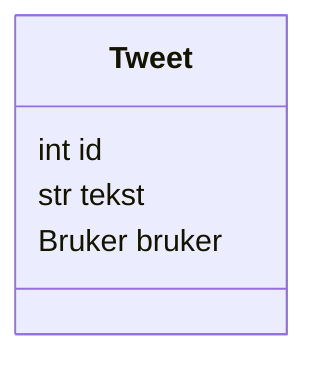

`Tweet`-klassen skal lagre informasjon om en tweet, det vil si tweetens tekst, en referanse til brukeren som har laget tweeten og en id.




## Oppgave: Lag Tweet-klassen

Krav:

- Klassen skal ha en klassevariabel `neste_id` som starter på 1
- `__init__` skal ta imot to argumenter: `tekst` og `bruker`
- Hvert nytt objekt skal:
  - få `id` lik `neste_id`
  - øke `neste_id` med 1
- Tweet-teksten lagres i `tekst`
- Brukeren som skrev tweeten lagres i `bruker`

<details>
<summary>Tips til bruk av klassevariabler for å få unik ID</summary>

Vi vil at hver tweet skal få en unik ID. Dette kan løses med en klassevariabel som deles av alle Tweet-objekter.
Her er et eksempel på bruk av en klassevariabel i en annen kode:

```python
class Plante:
    neste_plante_id = 1 # klassevariabel
    def __init__(self):
        self.id = Plante.neste_plante_id # setter self.id til å være lik klassevariabelen
        Plante.neste_plante_id += 1 # øker klassevariabelen med 1

# Lager en liste med 100 planter:
planter = [Plante() for i in range(100)]

# Hver plante har nå en unik id.
# Printer id til planten som ligger på indeks 40
print(planter[40].id)
```

</details>

<details>
<summary>Løsningsforslag</summary>

```python
class Tweet:
    neste_id = 1
    def __init__(self, tekst, bruker):
        self.id = Tweet.neste_id
        self.tekst = tekst
        self.bruker = bruker
        Tweet.neste_id += 1
```

</details>

## Testing

Med nøkkelordet `assert` kan vi forsikre oss at koden fungerer som den skal.
Hvis en `assert`-test ikke er `True` vil koden gi feilmelding og programmet stoppe.

Foreløpig har vi ikke laget `Bruker`-klassen, så vi sender `None` som bruker for å teste at ID-systemet fungerer:

```python
t1 = Tweet("Hei verden", None)
t2 = Tweet("Dette er en ny tweet", None)
t3 = Tweet("Wow! Denne Twitter-klonen er skikkelig kul", None)

assert t1.id == 1
assert t2.id == 2
assert t3.id == 3

print("Alt fungerer som det skal")
```
