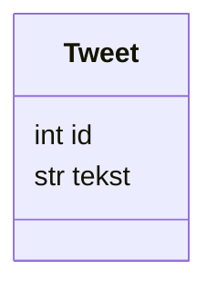

I denne delen lærer du å:

- lage en enkel klasse i Python
- bruke `__init__` til å opprette objekter
- bruke klassevariabler
- gi hvert objekt en unik ID
- enkel testing med `assert`

## Klassediagram for Tweet



## Klassevariabler og unik ID

Vi vil at hver tweet skal få en unik ID. Dette løses med en klassevariabel som deles av alle Tweet-objekter.

```python
class Plante:
    neste_plante_id = 1 # klassevariabel
    def __init__(self):
        self.id = Plante.neste_plante_id # setter self.id til å være lik klassevariabelen
        Plante.neste_plante_id += 1 # øker klassevariabelen med 1

# Lager en liste med 100 planter:
planter = [Plante() for i in range(100)]

# Hver plante har nå en unik id.
# Printer id til planten som ligger på indeks 40
print(planter[40].id)
```

## Oppgave: Lag Tweet-klassen

Krav:

- Klassen skal ha en klassevariabel `neste_id` som starter på 1
- Hvert nytt objekt skal:
  - få `id` lik `neste_id`
  - øke `neste_id` med 1
- Tweet-teksten lagres i `tekst`


## Testing

Med nøkkelordet `assert` kan vi forsikre oss at koden fungerer som den skal.
Hvis en `assert`-test ikke er `True` vil koden gi feilmelding og programmet stoppe.

```python
t1 = Tweet("Hei verden")
t2 = Tweet("Dette er en ny tweet")
t3 = Tweet("Wow! Denne Twitter-klonen er skikkelig kul")

assert t1.id == 1
assert t2.id == 2
assert t3.id == 3

print("Alt fungerer som det skal")
```

## Neste del

I neste del skal vi lage klassen `Bruker`, og la brukere eie og lage tweets.
