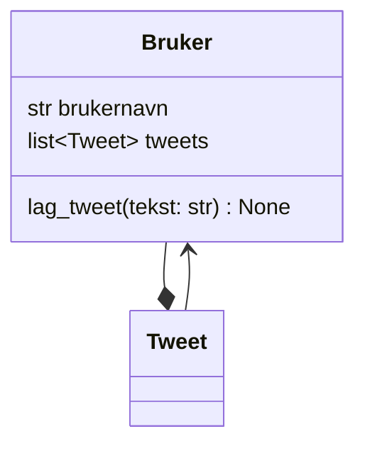

I Twitter-klonen vår representerer en bruker en person som har et brukernavn, kan skrive tweets og eier sine egne tweets.



Diagrammet viser at:
- En bruker eier mange tweets (komposisjon)
- Hver tweet har en referanse tilbake til brukeren (assosiasjon)

## Oppgave: Lag Bruker-klassen

Lag klassen `Bruker` i Python.

Krav:

- Klassen skal ha en `__init__`-metode
- `__init__` skal ta imot ett argument: `brukernavn`
- Brukeren skal ha:
  - en instansvariabel `brukernavn`
  - en instansvariabel `tweets` som starter som en tom liste
- Klassen skal ha metoden `lag_tweet(tekst: str)`

Metoden `lag_tweet()` skal:

1. opprette et nytt `Tweet`-objekt med teksten og `self` som bruker
2. legge tweeten til i `tweets`-listen

Ved å sende `self` til `Tweet` kan tweeten vite hvilken bruker som opprettet den.

<details>
<summary>Løsningsforslag</summary>

```python
class Bruker:
    def __init__(self, brukernavn: str):
        self.brukernavn = brukernavn
        self.tweets = []

    def lag_tweet(self, tekst: str):
        tweet = Tweet(tekst, self)
        self.tweets.append(tweet)
```

</details>

## Sjekk at koden fungerer

```python
b = Bruker("arsenal4ever")

b.lag_tweet("Fotball er skikkelig kult!")
b.lag_tweet("Arsenal er best!")

assert b.brukernavn == "arsenal4ever"
assert len(b.tweets) == 2
assert b.tweets[0].tekst == "Fotball er skikkelig kult!"
assert b.tweets[1].tekst == "Arsenal er best!"

# Sjekk at tweeten vet hvem som skrev den
assert b.tweets[0].bruker is b
assert b.tweets[0].bruker.brukernavn == "arsenal4ever"

print("Alt fungerer som det skal")
```

Legg merke til de to siste testene. De viser at vi kan navigere fra en tweet tilbake til brukeren som skrev den. Dette er nyttig når vi skal vise tweets i en feed og trenger å vise brukernavnet.
