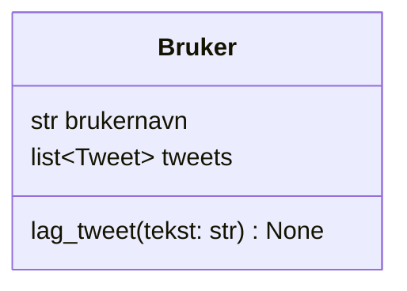

I denne delen lærer du å:

- lage en klasse som inneholder andre objekter
- bruke lister til å lagre objekter
- lage metoder som oppretter nye objekter
- forstå eierskap mellom objekter


## Hva er en Bruker?

I Twitter-klonen vår representerer en bruker en person som:

- har et brukernavn
- kan skrive tweets
- eier sine egne tweets

I koden skal en **ikke** vite noe om andre brukere eller om den globale feeden.
Det ansvaret ligger hos `Twitter`-klassen.


## Klassediagram for Bruker




## Bruker eier tweets

Når en bruker lager en tweet:

- opprettes et nytt `Tweet`-objekt
- tweeten lagres i brukerens `tweets`-liste

Dette er et eksempel på **komposisjon**:
- tweets eksisterer som en del av en bruker
- hvis brukeren forsvinner, forsvinner også tweetene


## Oppgave: Lag Bruker-klassen

Lag klassen `Bruker` i Python.

Krav:

- Klassen skal ha en `__init__`-metode
- `__init__` skal ta imot ett argument: `brukernavn`
- Brukeren skal ha:
  - en instansvariabel `brukernavn`
  - en instansvariabel `tweets` som starter som en tom liste
- Klassen skal ha metoden `lag_tweet(tekst: str)`


## Hva skal `lag_tweet()` gjøre?

Metoden `lag_tweet()` skal:

1. opprette et nytt `Tweet`-objekt
2. legge tweeten til i `tweets`-listen

Metoden skal **ikke** returnere noe.


## Sjekk at koden fungerer

```python
b = Bruker("arsenal4ever")

b.lag_tweet("Fotball er skikkelig kult!")
b.lag_tweet("Arsenal er best!")

assert b.brukernavn == "arsenal4ever"
assert len(b.tweets) == 2
assert b.tweets[0].tekst == "Fotball er skikkelig kult!"
assert b.tweets[1].tekst == "Arsenal er best!"

print("Alt fungerer som det skal")
```

## Neste del

I neste del skal vi lage klassen `Twitter`.

Der skal vi:
- lagre alle brukere i systemet
- finne brukere basert på brukernavn
- samle alle tweets til en global feed
