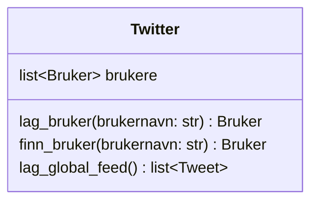

I denne delen lærer du å:

- lage en klasse som holder oversikt over mange objekter
- lagre og finne brukere i en liste
- samle data fra flere objekter
- sortere en liste med objekter

## Hva er Twitter-klassen?

I Twitter-klonen vår er Twitter selve systemet. Den skal:

- holde oversikt over alle brukere
- kunne lage nye brukere
- kunne finne en bruker basert på brukernavn
- lage en global feed ved å samle alle tweets fra alle brukere

Twitter skal ikke lage tweets direkte.
Tweets lages av Bruker-objekter.


## Klassediagram for Twitter




## Twitter eier brukere

Twitter inneholder en liste av brukere:

- brukere er en liste med Bruker-objekter
- hver bruker har sine egne tweets

Dette er også komposisjon:
- brukere eksisterer som en del av systemet
- tweets eksisterer som en del av brukerne

## Oppgave: Lag Twitter-klassen

Lag klassen Twitter i Python.

Krav:

- Klassen skal ha en `__init__`-metode
- `__init__` skal lage en tom liste brukere
- Klassen skal ha metodene:
  - `lag_bruker(brukernavn: str) -> Bruker`
  - `finn_bruker(brukernavn: str) -> Bruker | None`
  - `lag_global_feed() -> list[Tweet]`


## Metode: lag_bruker

`lag_bruker` skal:

1. opprette et nytt Bruker-objekt
2. legge brukeren i lista brukere
3. returnere den nye brukeren

## Metode: finn_bruker

`finn_bruker` skal:

- gå gjennom alle brukere i lista
- returnere brukeren hvis brukernavn matcher
- returnere None hvis ingen matcher

## Metode: lag_global_feed

`lag_global_feed` skal:

1. samle alle tweets fra alle brukere
2. sortere tweetene slik at nyeste tweet kommer først

I vårt system betyr nyeste at tweeten har høyest id.

## Sortering av tweets

Når du har en liste med Tweet-objekter, kan du sortere på id.

Eksempel:
```python
alle_tweets.sort(key=attrgetter("id"), reverse=True)
```

Dette sorterer slik at tweet med høyest id kommer først.

## Sjekk at koden fungerer

Kjør koden under. Den skal kjøre uten feil.

```python
tw = Twitter()

ada = tw.lag_bruker("ada")
bob = tw.lag_bruker("bob")

ada.lag_tweet("A1")
bob.lag_tweet("B1")
ada.lag_tweet("A2")

assert tw.finn_bruker("ada") is ada
assert tw.finn_bruker("bob") is bob
assert tw.finn_bruker("ingen") is None

feed = tw.lag_global_feed()
assert [t.tekst for t in feed] == ["A2", "B1", "A1"]

print("Alt fungerer som det skal")
```

## Diskusjonsoppgaver

Svar på spørsmålene før du går videre:

1. Hvorfor er det Twitter-klassen som lager global feed og ikke Bruker?
2. Hvorfor returnerer finn_bruker None når den ikke finner noen?
3. Hva er fordelen med at Tweet har en ID som øker for hver tweet?

## Neste del

I neste del skal vi begynne med Flask.

Der skal vi:
- lage en enkel web-app
- lage ruter som viser og oppretter data
- koble sammen klassene og nettsiden
