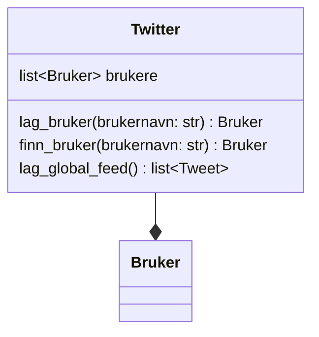

I Twitter-klonen vår er `Twitter`-klassen selve systemet. Den skal:

- holde oversikt over alle brukere
- kunne lage nye brukere
- kunne finne en bruker basert på brukernavn
- lage en global feed ved å samle alle tweets fra alle brukere

Twitter skal ikke lage tweets direkte.
Tweets lages av Bruker-objekter.

## Klassediagram for Twitter




## Twitter eier brukere

Twitter inneholder en liste av brukere:

- brukere er en liste med Bruker-objekter
- hver bruker har sine egne tweets

Dette er også komposisjon:
- brukere eksisterer som en del av systemet
- tweets eksisterer som en del av brukerne

## Oppgave: Lag Twitter-klassen

Lag klassen `Twitter` i Python.

Krav:

- Klassen skal ha en `__init__`-metode
- `__init__` skal lage en tom liste brukere
- Klassen skal ha metodene:
  - `lag_bruker(brukernavn: str) -> Bruker`
  - `finn_bruker(brukernavn: str) -> Bruker | None`
  - `lag_global_feed() -> list[Tweet]`


**Metode: lag_bruker**

`lag_bruker()` skal:

1. opprette et nytt Bruker-objekt
2. legge brukeren i lista brukere
3. returnere den nye brukeren

**Metode: finn_bruker**

`finn_bruker()` skal:

- gå gjennom alle brukere i lista
- returnere brukeren hvis brukernavn matcher
- returnere None hvis ingen matcher

**Metode: lag_global_feed**

`lag_global_feed()` skal:

1. samle alle tweets fra alle brukere
2. sortere tweetene slik at nyeste tweet kommer først

I vårt system betyr nyeste at tweeten har høyest id.

## Sortering av tweets

Når du har en liste med Tweet-objekter, kan du sortere på id.

For å sortere på et attributt kan vi bruke en lambda-funksjon:

```python
alle_tweets.sort(key=lambda tweet:tweet.id, reverse=True)
```

Dette sorterer slik at tweet med høyest id kommer først.

<details>
<summary>Løsningsforslag</summary>

```python
class Twitter:
    def __init__(self):
        self.brukere = []

    def lag_bruker(self, brukernavn: str) -> Bruker:
        bruker = Bruker(brukernavn)
        self.brukere.append(bruker)
        return bruker

    def finn_bruker(self, brukernavn: str) -> Bruker | None:
        for bruker in self.brukere:
            if bruker.brukernavn == brukernavn:
                return bruker
        return None

    def lag_global_feed(self) -> list[Tweet]:
        alle_tweets = []
        for bruker in self.brukere:
            alle_tweets += bruker.tweets
            alle_tweets.sort(key=lambda tweet:tweet.id, reverse=True)
        return alle_tweets
```

</details>

## Sjekk at koden fungerer

Kjør koden under. Den skal kjøre uten feil.

```python
tw = Twitter()

ada = tw.lag_bruker("ada")
bob = tw.lag_bruker("bob")

ada.lag_tweet("A1")
bob.lag_tweet("B1")
ada.lag_tweet("A2")

assert tw.finn_bruker("ada") is ada
assert tw.finn_bruker("bob") is bob
assert tw.finn_bruker("ingen") is None

feed = tw.lag_global_feed()
assert [t.tekst for t in feed] == ["A2", "B1", "A1"]

# Sjekk at vi kan finne brukernavn fra tweets i feeden
assert feed[0].bruker.brukernavn == "ada"
assert feed[1].bruker.brukernavn == "bob"
assert feed[2].bruker.brukernavn == "ada"

print("Alt fungerer som det skal")
```

De siste testene viser hvordan vi kan navigere fra en tweet i feeden til brukeren som skrev den. Dette er nyttig når vi skal vise feeden i HTML.

## Samle klassene i én fil

Lag filen `twitter.py` og legg alle tre klassene i samme fil:

```python
from operator import attrgetter

class Tweet:
    # ...

class Bruker:
    # ...

class Twitter:
    # ...
```

Rekkefølgen er viktig: `Tweet` må komme før `Bruker` (fordi `Bruker` bruker `Tweet`), og begge må komme før `Twitter`.

## Neste del

I neste del skal vi koble klassene til en Flask-app med HTML.
